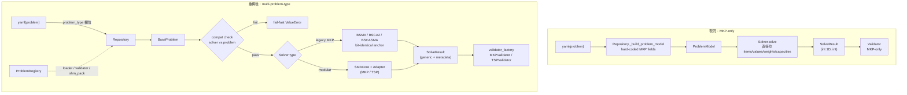

# 整體目標

依使用者選擇的 **route_c（Algorithm Core + Problem Adapter 兩段式）+ phase1_plus_real_tsp_solver（端到端 TSP）**，把：

1. 資料/IO 層 從 MKP-only 抽象成 **problem-type 註冊式**
2. 演算法層以 **BSMA 為 pilot** 拆出 SMA core + MKP adapter（同個 SMA core 也能掛 TSP adapter）
3. 加入一份真實 **TSP problem + TSP solver**，端到端驗證跨 problem_type 跑通

既有 [`solver/BSMA.py`](solver/BSMA.py) / [`solver/BSCA2.py`](solver/BSCA2.py) / [`solver/BSCASMA.py`](solver/BSCASMA.py) 與對應 valid trace **完全不動**，作為 regression anchor；新架構走「並行新檔」策略。

# 關鍵設計決策

## 為什麼 modular pilot 只挑 BSMA？

- BSMA 是「純 SMA + MKP-specific helper（pseudo_utility / repair / initial_pop）」，最容易拆得乾淨。
- BSCA2（純 SCA）與 BSCASMA（SMA+SCA+RL）拆起來工作量是 BSMA 的 2-3 倍，且第一階段 pilot 的目的是驗證架構，不是把所有 solver modularize 完。
- 三個既有 solver 在 phase1 只標 metadata（`compatible_problem_types=("mkp",)`、`compatible_encodings=("binary",)`），內部與輸出完全不變。

## SMA core 的 inner space 抽象

原版 BSMA 的 `pop_sol` 是 0/1 binary 但局部公式內當 continuous 計算後再 transformer 回 0/1。pilot 把這個拆乾淨：

- **SMA core 內部 state**：`position: ndarray (pop_size, dim_position)` 為 float、`fitness: ndarray (pop_size,)` 為 numeric。
- **Adapter 介面**（problem 端負責）：
  ```python
  class ProblemAdapter(Protocol):
      problem_type: str        # "mkp" / "tsp"
      encoding: str            # "binary" / "permutation" / "real_vector"
      direction: Literal["max", "min"]
      dim_position: int        # SMA inner space 維度

      def initial_position(self, rng) -> np.ndarray  # shape (pop_size, dim_position)，可問題特異 heuristic 初始
      def decode_and_evaluate(self, position_row) -> tuple[np.ndarray, float]  # (decoded_solution, objective)
      def position_update_post_hook(self, position_row) -> np.ndarray  # 把 SMA 計算後的 position 還原 / 修補（MKP 的 tanh 轉 binary 在這裡）
      def early_stop(self, gbest_objective) -> bool  # 與 best_known 比較，問題型自己決定
  ```
- SMA core 只負責 W 更新、SMA 全局/局部公式、sort、Gbest、iter loop、終止；不知道 problem 細節。

## 與 BSMA bit-identical 的關係

**modular SMA + MKP adapter 不會與原 BSMA bit-identical**（內部 RNG 順序會不同）。所以：

- 不刪 [`solver/BSMA.py`](solver/BSMA.py)、[`tests/test_bsma_equivalence.py`](tests/test_bsma_equivalence.py)、[`valid/bsma_population_trace.py`](valid/bsma_population_trace.py)。
- modular 版以新 solver_id `sma_mkp_modular_v1` 註冊，獨立的 yaml `configs/solvers/sma_mkp_modular_v1.yaml`。
- modular 版的測試只驗「合理範圍 final objective」（例如 weish01 5000 iter 至少接近原 BSMA 的 best_known），不要求 bit-identical。

# 改動明細

## 第一階段 A：資料/IO 層解耦

### 1) [`engine/models.py`](engine/models.py)：ProblemModel 拆 base + MKP

抽 `BaseProblem`（dataclass frozen）：
```python
@dataclass(frozen=True)
class BaseProblem:
    problem_id: str
    dataset: str
    problem_type: str           # 與 ProblemRegistry 對齊
    encoding: str               # "binary" / "permutation" / "real_vector"
    direction: Literal["max", "min"]
    best_known: int | float | None  # 鬆綁，TSP 可能無證明最佳
```

`MKPProblem(BaseProblem)`：保留現有 `items / dim / values / weights / capacities` 與 `__post_init__` 驗證，固定 `problem_type="mkp"` / `encoding="binary"` / `direction="max"`。

### 2) `SolveResult` 鬆綁

- `best_solution: np.ndarray`：移除 `_as_int_array` 強制；改由各 problem-type 的 validator 在驗證階段檢查 dtype。
- `best_objective: int | float`：MKP 仍 int、TSP 仍 int（distance）、continuous 為 float。
- 新增 `metadata: Mapping[str, Any]`：`linprog_runtime` 移到這裡（既有讀取 `linprog_runtime` 的 stat 模組改讀 `metadata.get("linprog_runtime", 0.0)`）。

### 3) [`engine/problem_registry.py`](engine/problem_registry.py)：新增

```python
@dataclass(frozen=True)
class ProblemTypeSpec:
    problem_type: str
    encoding: str
    direction: Literal["max", "min"]
    loader: Callable[[dict, ...], BaseProblem]   # yaml dict → ProblemModel
    validator_factory: Callable[[], BaseValidator]
    shm_pack_factory: Callable[[BaseProblem], BaseShmPack] | None  # None=無 shm
    yaml_required_fields: tuple[str, ...]
```

`ProblemRegistry`（仿 [`solver/registry.py`](solver/registry.py)）`register / get / list_problem_types`。

### 4) [`engine/repository.py`](engine/repository.py)：通用化 loader

- `_build_problem_model` 改為先讀 `data.get("problem_type", "mkp")`（缺欄則預設 mkp 以保 backward compat），透過 `ProblemRegistry.get(problem_type).loader(data, ...)` 派發。
- 既有 MKP yaml 不需動（缺 `problem_type` 自動 fallback）。新題類型必須在 yaml 寫 `problem_type: tsp`。

### 5) [`engine/bank.py`](engine/bank.py)：泛化 SHM pack

- 抽 `BaseShmPack`，`MKPShmPack` 是 subclass（保留現有 values/weights/capacities 三塊 shm）。
- `ProblemBank.build_for_spec` 透過 `ProblemRegistry.get(...).shm_pack_factory` 建對應 pack。
- 對 TSP（小規模實驗用），shm_pack_factory 可暫時回 `None`，意思是不走 shm，每個 worker 自己 load yaml；MKP 的高效路徑保留。

### 6) [`solver/validator.py`](solver/validator.py)：抽 BaseValidator + MKPValidator

```python
class BaseValidator(Protocol):
    def validate(self, problem: BaseProblem, solve_result: SolveResult) -> ValidationReport: ...
```

`MKPValidator` = 現有 `Validator` 邏輯。`ValidationReport` 加 `metadata: Mapping[str, Any]`（裝 problem-type 特有欄位，例如 TSP 的 `tour_length`），共同欄位（`is_feasible / objective_valid / recomputed_objective / objective_mismatch / best_known_reached / best_known_gap`）保留。

`Simulator` 透過 `ProblemRegistry.get(problem.problem_type).validator_factory()` 取對應 validator，不再硬呼 `Validator()`。

### 7) Solver 能力宣告

[`solver/registry.py`](solver/registry.py) 的 `Solver` Protocol 加 class attribute（不在 method 上）：

```python
class Solver(Protocol):
    compatible_problem_types: tuple[str, ...]
    compatible_encodings: tuple[str, ...]
    def solve(self, problem: BaseProblem, config: dict, rng: np.random.Generator) -> SolveResult: ...
```

`ExperimentSpec` 驗證階段（[`cli/run/support.py::validate_execute_args`](cli/run/support.py)）：
1. 對每個 problem_id 解析 `problem_type`（透過輕量 yaml 讀第一個 mapping 的 `problem_type` 欄位）
2. 對 solver_id 取 `compatible_problem_types / compatible_encodings`
3. 不相容立即 `raise ValueError("solver bsma_v1_008 (mkp/binary) cannot solve problem tsp/permutation")`

### 8) 既有 MKP solver 標 metadata（不改邏輯）

- [`solver/BSMA.py::BSMAV1008Solver`](solver/BSMA.py) 加 `compatible_problem_types=("mkp",)` / `compatible_encodings=("binary",)`，把 `linprog_runtime` 在 `SolveResult` 改放 `metadata`。
- 同樣處理 [`solver/BSCA2.py::BSCA2V120Solver`](solver/BSCA2.py)、[`solver/BSCASMA.py::BRLSMASCA2V100320050TestSolver`](solver/BSCASMA.py)。
- 既有 valid trace 與 equivalence 測試不受影響（內部 Core 邏輯不變、SolveResult 結構僅增不減）。

### 9) [`tools/stat.py`](tools/stat.py) / output schema

- `runs.csv` / `runs.jsonl` 增加欄位：`problem_type`、`encoding`、`metadata_json`（dict 序列化成 json string）。
- `summary.csv` / `summary.json` 加 `problem_type` 欄位以做分組統計。
- 既有 MKP 輸出與舊欄位完全保留（only additive，不破壞下游分析腳本）。

## 第一階段 B：SMA core / MKP adapter pilot

### 10) [`solver/sma_core.py`](solver/sma_core.py)：新增

純 SMA 演算法本體（無 problem 知識）：
```python
class SMACore:
    def __init__(self, dim_position, pop_size, max_iter, z, seed): ...
    def run(self, adapter: ProblemAdapter) -> tuple[np.ndarray, float, dict]:
        # 內部維護 position / fitness / W / Gbest
        # 每代：update_W → for i: 拋硬幣決定全局/局部 → adapter.position_update_post_hook → adapter.decode_and_evaluate → sort → Gbest → adapter.early_stop
        # 回傳 (best_position, best_objective, metadata{evaluation_count, ...})
```

### 11) [`solver/adapters/__init__.py`](solver/adapters/__init__.py) + [`solver/adapters/mkp_sma_adapter.py`](solver/adapters/mkp_sma_adapter.py)

`MKPSMAAdapter`：
- `dim_position = problem.items`
- `initial_position`：用 cp_list（linprog 偽效用）機率取樣 binary，與原 BSMA initial_pop 邏輯相同
- `position_update_post_hook`：tanh transformer 轉 0/1
- `decode_and_evaluate`：repair（按 cp_list 順序維持可行）+ `np.dot(values, sol)`
- `early_stop`：`objective >= problem.best_known`
- `compatible_with(problem) -> bool`：`problem.problem_type == "mkp"`

### 12) [`solver/sma_mkp_modular.py`](solver/sma_mkp_modular.py)：組 solver

```python
@dataclass
class SMAMKPModularV1Solver:
    compatible_problem_types = ("mkp",)
    compatible_encodings = ("binary",)
    def solve(self, problem, config, rng) -> SolveResult:
        adapter = MKPSMAAdapter(problem)
        core = SMACore(dim_position=adapter.dim_position, ...)
        best_pos, best_obj, meta = core.run(adapter)
        return SolveResult(..., best_solution=best_pos.astype(int), best_objective=int(best_obj), metadata=meta)
```

[`configs/solvers/sma_mkp_modular_v1.yaml`](configs/solvers/sma_mkp_modular_v1.yaml)。
[`engine/builders.py`](engine/builders.py) 註冊；[`simulator/core.py::_PROCESS_SAFE_SOLVERS`](simulator/core.py) 加入。

## 第一階段 C：TSP 端到端

### 13) [`engine/models.py`](engine/models.py)：新增 `TSPProblem`

```python
@dataclass(frozen=True)
class TSPProblem(BaseProblem):
    n_cities: int
    distance_matrix: np.ndarray   # shape (n_cities, n_cities), int
    coords: np.ndarray | None = None  # 可選 shape (n_cities, 2)
```

`__post_init__` 驗證對稱性（如 symmetric TSP）、對角線為 0、形狀。固定 `problem_type="tsp"` / `encoding="permutation"` / `direction="min"`。

### 14) [`solver/validator_tsp.py`](solver/validator_tsp.py)：`TSPValidator`

- 檢查 solution 是否為 `[0..n_cities-1]` 的合法 permutation
- 重算 tour cost：sum of distance_matrix[sol[i], sol[(i+1)%n]]
- best_known_reached：`obj <= best_known`（min direction），best_known 為 None 時略過
- ValidationReport.metadata 裝 `tour_length`、`is_valid_permutation`

### 15) [`configs/problems/tsp/SMALL/tsp5.yaml`](configs/problems/tsp/SMALL/tsp5.yaml) 與 `tsp10.yaml`

兩個小型 TSP（5 城市、10 城市），手算或 brute-force 驗證 best_known。yaml schema：
```yaml
problem_id: tsp5
dataset: SMALL
problem_type: tsp
n_cities: 5
distance_matrix:
  - [0, 10, 15, 20, 25]
  - ...
best_known: 65
```

### 16) [`solver/adapters/tsp_sma_adapter.py`](solver/adapters/tsp_sma_adapter.py)：TSP-SMA adapter（random key 編碼）

- `dim_position = n_cities`
- `initial_position`：每維 uniform [0, 1] random key
- `position_update_post_hook`：clip to [0, 1]
- `decode_and_evaluate`：argsort(position) → permutation → 計算 tour cost；不需 repair（permutation 必合法）
- `early_stop`：`objective <= best_known`（若 best_known 非 None）

### 17) [`solver/sma_tsp_modular.py`](solver/sma_tsp_modular.py)：組 solver `sma_tsp_modular_v1`

同 SMAMKPModularV1Solver 結構，掛 TSPSMAAdapter。

### 18) 額外：一個非 SMA 的 TSP solver 作 sanity check

[`solver/nearest_neighbor_tsp.py`](solver/nearest_neighbor_tsp.py)：純 NN heuristic，跑出 deterministic 結果，給 TSP validator 與整個 pipeline 一個簡單參照點。`solver_id = "nn_tsp_v1"`。

## 第一階段 D：CLI / 測試 / 文件

### 19) CLI

[`cli/run/support.py::validate_execute_args`](cli/run/support.py)：
- 加 problem-type / encoding / direction 相容性 check（從 yaml 讀 problem_type）。
- 失敗訊息明確：`solver=bsma_v1_008 (compatible: mkp/binary) ↔ problem=tsp5 (problem_type=tsp, encoding=permutation) → 不相容，請選 tsp 系列 solver。`

CLI 不加新參數（problem_type 從 yaml 自動推斷）。

### 20) 測試

新增：
- [`tests/test_problem_registry.py`](tests/test_problem_registry.py)：註冊 / 重複註冊 / 取不存在的 problem_type / list。
- [`tests/test_compatibility_check.py`](tests/test_compatibility_check.py)：故意組 `solver=bsma_v1_008 + problem_type=tsp` 期望 fail-fast；組正確的期望通過。
- [`tests/test_tsp_problem_model.py`](tests/test_tsp_problem_model.py)：TSPProblem 驗證對稱、對角線 0、shape。
- [`tests/test_tsp_validator.py`](tests/test_tsp_validator.py)：合法/非法 permutation、tour cost 重算、best_known_reached。
- [`tests/test_sma_mkp_modular.py`](tests/test_sma_mkp_modular.py)：跑 weish01 5000 iter，best_objective 在 [4400, 4554] 合理區間（不要求 bit-identical 與 BSMA）。
- [`tests/test_sma_tsp_modular.py`](tests/test_sma_tsp_modular.py)：跑 tsp5（brute-force 已知最佳）跑出 best_known；跑 tsp10 期望 gap < 10%。
- [`tests/test_nn_tsp.py`](tests/test_nn_tsp.py)：NN heuristic 對 tsp5 / tsp10 跑出 deterministic 結果，並通過 TSPValidator。

更新（保留現有覆蓋率，且仍綠）：
- [`tests/test_bsma_solver.py`](tests/test_bsma_solver.py) / [`tests/test_bsca2_solver.py`](tests/test_bsca2_solver.py) / [`tests/test_bscasma_solver.py`](tests/test_bscasma_solver.py)：增加 `assert solver.compatible_problem_types == ("mkp",)` 等斷言。
- [`tests/test_bsma_equivalence.py`](tests/test_bsma_equivalence.py) / [`tests/test_bsca2_equivalence.py`](tests/test_bsca2_equivalence.py) / [`tests/test_bscasma_equivalence.py`](tests/test_bscasma_equivalence.py)：保持 bit-identical 全綠（regression anchor）。
- [`tests/test_validator.py`](tests/test_validator.py) / [`tests/test_contracts.py`](tests/test_contracts.py)：適配 `metadata` 欄位、ValidationReport 新欄位。
- [`tests/test_app.py`](tests/test_app.py)：對 MKP CLI 行為不變；可選加 1-2 個 TSP CLI smoke test。
- [`tests/test_stat.py`](tests/test_stat.py)：對應 `runs.csv` / `runs.jsonl` 的新欄位。

### 21) Log

依使用者規則更新 `log/對話紀錄.md`、`log/程式碼更新紀錄.md`、`log/專案歷程.md`：本次討論、決策（route_c + phase1_plus_real_tsp）、代價（modular 版不與 old bit-identical）、新模組與 registry 的使用方式。

# 資料流（before vs after）



# 新增 problem-type 的「操作手冊」

未來加 VRP（舉例）只要：

1. 新增 `engine/models.py::VRPProblem(BaseProblem)`
2. 新增 `solver/validator_vrp.py::VRPValidator`
3. 新增 `engine/loaders/vrp_loader.py`
4. 在某啟動處註冊到 `ProblemRegistry`
5. 寫 yaml `problem_type: vrp ...`
6. （想跑 SMA 解 VRP 的話）寫 `solver/adapters/vrp_sma_adapter.py` + `solver/sma_vrp_modular.py`

完全不需要動既有 MKP / TSP 路徑。

# 風險與權衡（明示）

1. **modular SMA 不會 bit-identical 原 BSMA**：因為 RNG 順序變了。pilot 路徑與 anchor 路徑共存，使用者要自己決定哪個 solver_id 是「正式」版本。
2. **問題的編碼相容性靠 metadata 自宣告**：寫錯（例如 BSMA 標 encoding=permutation）系統不會自動察覺。可加 unit test 鎖定 metadata 不被誤改。
3. **TSP shm 暫時不做**：每 worker 自己 load yaml 對小規模 ok；若未來要跑大規模 TSP 多並行 worker，shm pack 要補。
4. **adapter 矩陣未來會增**：route_c 的天生缺點。第一階段只 2 個 (MKP, TSP) × 1 個 (SMA core) = 2 個 adapter；之後若 BSCA2 / BSCASMA 也 modularize，會再多 4 個 adapter。可接受。
5. **Output schema 變化是 only-additive**：下游分析腳本不會壞，但會多兩欄。

# 工作量估算

- 第一階段 A（資料/IO 層）：約 500-800 行新增 + 200 行修改
- 第一階段 B（SMA pilot）：約 400-600 行新增
- 第一階段 C（TSP 端到端）：約 400-600 行新增（含 yaml 與測試資料）
- 第一階段 D（CLI / 測試 / log）：約 600-1000 行新增

合計約 2000-3000 行新增、200-400 行修改。完成後 `pytest tests/ -m "not slow"` 應 ≥ 145 passed（130 既有 + 15+ 新增）。