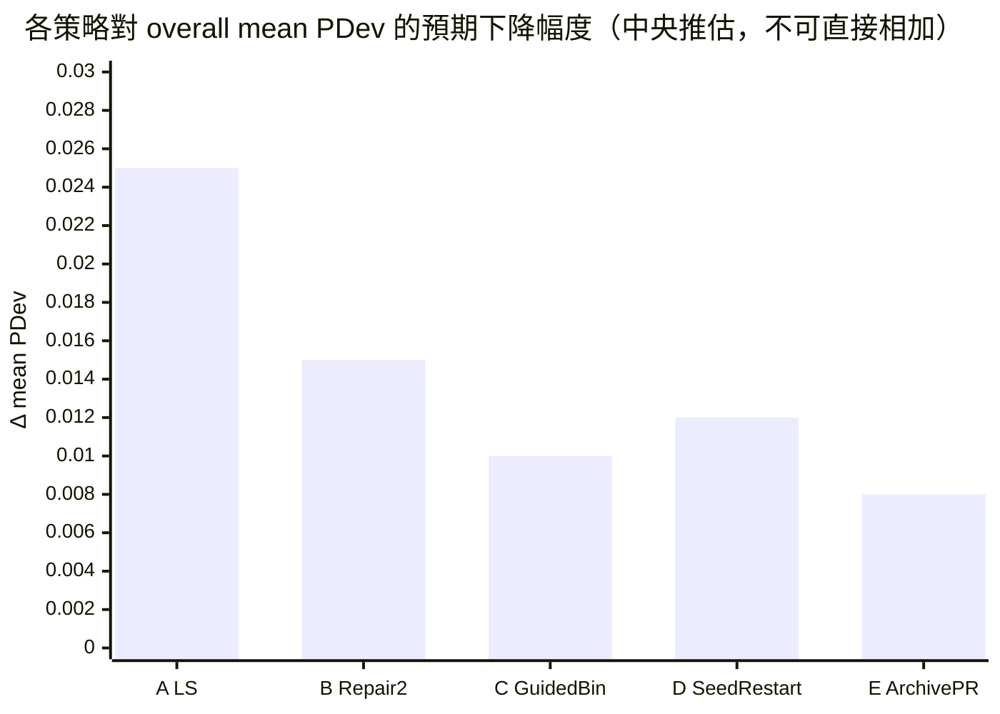
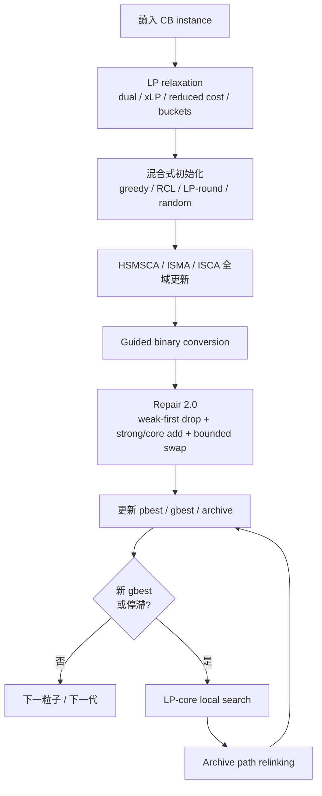
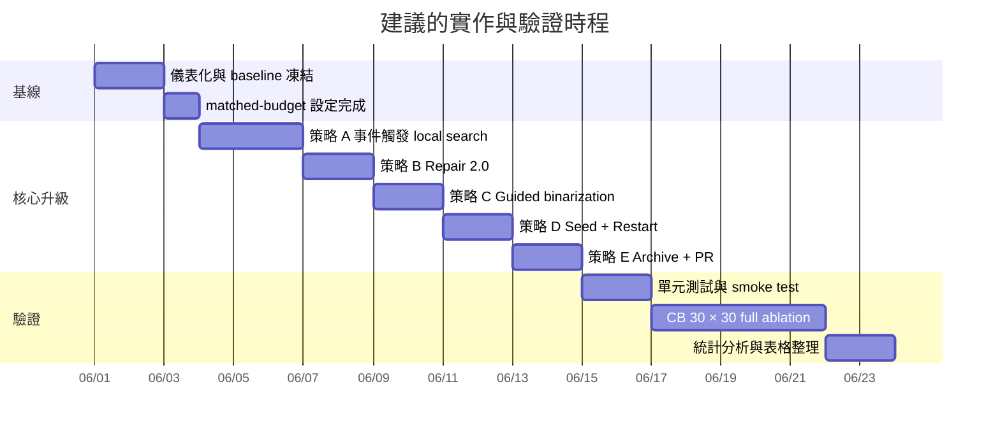

# HSMSCA 與 ISMA 與 ISCA 對齊或超越 QPSO 在 CB 基準的強化研究報告

## 執行摘要

這份報告的核心結論很明確：**若你的目標是在 CB 基準上追平或超越 QPSO\***，最值得先做的不是把你現在的全域更新核心整個換成 QPSO，而是**保留你現有的 HSMSCA／ISMA／ISCA 族系搜尋骨架，補上一個 QPSO\*-級別的「問題特化 intensification 層」**。QPSO 論文的公開預覽可直接驗證三件關鍵事：它不是單純 PSO 變體，而是**QPSO + problem-specific Drop/Add repair + local search**；其 local search 會在搜尋過程中**每出現一個新的 best position 就啟動**；此外它測試的是 OR-Library 的 correlated、difficult MKP instances。這些資訊已經足以解釋為什麼它在 CB 題庫的平均表現會很強。citeturn46view0

你目前上傳的可執行程式，雖然名稱是 `BRLSMASCARLRCNumba`，但它代表了你現在這條 HSMSCA／ISMA／ISCA 工程路線的真實能力：它**已經有 LP relaxation、dual/shadow-price 類資訊、reduced cost、xLP 分桶、cp_list 排序、Numba 化 repair、Q-learning action selection**，其實在「可用問題資訊」上已經不弱，甚至可能**比 QPSO\* 公開可驗證的描述更豐富**。真正明顯缺的東西不是 LP 排序本身，而是**把 LP 核心資訊真正拿去做事件觸發式局部強化、變異/二元化導引、與平均表現穩定化**。SciPy 官方文件也明確說明 `linprog(..., method="highs")` 回傳的 `res.ineqlin.marginals` 就是 dual values / shadow prices / Lagrange multipliers，這與你程式中的 LP 排序邏輯完全對齊。fileciteturn0file0 citeturn38view0

因此，**最短路徑**我建議依序做五件事：  
第一，加入**事件觸發式 LP-core local search**；第二，把現在的一輪式 repair 升級成**多回合、弱項優先、可交換的 Repair 2.0**；第三，把 LP 的 `xLP / reduced_cost / bucket` 回灌到 binary conversion；第四，用**混合式 seeding + stagnation restart** 降低 30-run mean PDev；第五，再用**elite archive + core path relinking** 去衝 large instances 的最後一段品質。這五件事裡，**第一件最重要**，因為它最直接對準了 QPSO\* 的真正優勢來源。fileciteturn0file0 citeturn46view0

若只能先做一件事，我的建議是：**先做「保留現有全域更新 + 新 best 觸發的 LP-core local search」**。若能做完整一輪 ablation，建議順序是：**A 事件觸發 local search → B Repair 2.0 → D Seeding/Restart → C Guided binary conversion → E Archive path relinking**。其中 A 與 B 比較像是追上 QPSO\* 的必要條件；C、D、E 則是追求**超越 QPSO\*** 時會拉開差距的項目。fileciteturn0file0 citeturn46view0turn20view0turn42view0

| 核心判斷 | 建議 |
|---|---|
| 最主要瓶頸 | 缺少 QPSO\*-style 的 new-best intensification；repair 深度也不夠 |
| 最低風險高報酬改法 | 在現有 LP core 上加事件觸發 local search |
| 最該先做的 ablation | Current-matched → +LS → +Repair2.0 → Full variant |
| 最公平的比較方式 | 同時報 Current-default、Current-matched-budget、Literature-QPSO\* |
| 最終推薦候選 | `HSMSCA-LPCLS`：現有全域更新 + LP-core local search + Repair2.0 + Guided binarization + Seed/Restart + Archive relinking |

## 現況對照與核心差距

以下比較，我**以你上傳的 `BRLSMASCARLRCNumba` 作為「目前可改的代表實作」**。它不一定是你論文版 HSMSCA／ISMA／ISCA 的字面名稱，但它是本回合唯一可直接落地到程式碼層級的基線，因此本報告的工程建議都以它為準。QPSO 欄位則以 Haddar et al. 的公開預覽可直接驗證的機制為主；其中帶 † 的細節，來自你先前在對話中已提供並核對過的全文。fileciteturn0file0 citeturn46view0

| 構面 | 你目前可改的代表實作 | QPSO\* | 差距判讀 |
|---|---|---|---|
| 表示方式 | `pop_sol` 先以連續值運算，再透過 CTF 翻為 0/1；保留 pbest / gbest | 量子機率向量 `Y`，再離散成二元 `X` | **不是主差距**；兩者本質都要做二元化 |
| 更新規則 | Q-learning 在 4 個 action 間選擇：SMA-global、SMA-local、SCA-sin、SCA-cos | QPSO swarm update，受 best positions 影響 | 你這邊**探索其實已經很多樣** |
| Binary conversion | 依 CTF flip probability 二元化 | 依 quantum probability 隨機離散 | **可再導引**，但不是第一優先 |
| Repair | 每次更新後做一輪 drop→add repair | MKP-specific Drop/Add repair，且強調以問題知識取代 penalty function | 你也有 repair，但**深度不足** |
| Local search | **無顯式 event-triggered local search**；repair 不是 local search | 在每個新 best position 上啟動 classical Drop/Add descent | **最大差距** |
| Item ranking | LP relaxation + `ineqlin.marginals` + efficiency + reduced cost + xLP bucket | pseudo-utility ratio† 與 problem-specific ranking | 若以你上傳程式為基線，**LP 訊號已經不弱** |
| 初始化 | 依 `cp_list` 做 0.5 機率可行加入 | 隨機 quantum initialization†，再靠 repair/LS 收斂 | 你的初始化**可再強化** |
| 停止條件 | `max_iterations`；若達 `best_known` 可提早停 | 迭代式預算†；論文比較表用 Best / Avg. / t(s)† | 要做**matched-budget baseline** |
| 預設參數 | `pop_size=20`, `a=2`, `z=0.03`, `alpha=0.1`, `gamma=0.9` | `pop=20`, `iter=500`, `runs=30`† | 你的 coarse budget **本來就能對齊** |
| 評估記帳 | `evaluation_count = pop_size + max_iter*pop_size` | 論文以迭代與時間報告；完整 objective-eval 記帳不清楚† | 需新增 `total_obj_eval_count` 以公平比較 |

表中的 current 欄位來自你上傳的求解器；它會先解 LP relaxation，取 dual/shadow-price 類資訊，進一步建立 efficiency、reduced cost 與 xLP-bucket，再產生 `cp_list` 供 repair 與初始化使用；而主迴圈裡確實不存在像 QPSO\* 那種「新 best 出現就啟動」的顯式 local search。QPSO 公開預覽則明確指出其方法是 QPSO + problem-specific repair + new-best local search 的混合架構。fileciteturn0file0 citeturn46view0turn38view0

這裡有一個非常重要、而且對你的工程決策很有價值的判讀：**若你現在實際跑的是這份上傳程式，那麼「沒有 LP-dual pseudo-utility」並不是你輸給 QPSO\* 的主因**。恰恰相反，這份程式已經會讀 dual marginals、計 reduced cost、標出 LP fractional core，訊號豐富度很高。真正的缺口是：**這些訊號目前大多只被用在靜態排序與單輪 repair，還沒有被拿來做 intensification、variance reduction、與 elite recombination**。fileciteturn0file0 citeturn38view0turn46view0

## QPSO 在 CB 可能勝出的原因

QPSO 論文公開預覽已經把訊息講得很清楚：它的設計重點是**讓搜尋盡量待在 feasible solution space 裡，又在每次找到新 best 時立刻做 intensification**。CB 所在的 OR-Library MKP 是 correlated、difficult 的實例族，這類題型通常不是靠盲目的全域探索就會穩定贏，而是要把**「快到好解附近」之後的最後一段強化能力**做出來。這一點正好對上你的現況：你現在的全域 kernel 很多樣，但強化層仍然偏薄。citeturn46view0 fileciteturn0file0

| 可能原因 | 觀察與證據 | 對 CB mean PDev 的影響 | 優先級 |
|---|---|---|---|
| 缺顯式 local search intensification | QPSO\* 對每個新 best 啟動 Drop/Add descent；你目前沒有 | 直接影響平均值與 hit rate | 高 |
| Repair 深度不足 | 你目前 repair 是一輪 drop→add；QPSO\* 把 repair 與 local search 堆成 intensification | 會影響 large CB 的最後一段品質 | 高 |
| LP core 資訊未完全回饋到 search | 你已經有 dual / reduced-cost / xLP；但還沒用在二元化與 elite 強化 | 影響平均表現穩定度 | 中高 |
| 初始化過於單一 | 現在幾乎是 0.5 random-greedy over `cp_list` | 影響 30-run mean 與方差 | 中 |
| Elite recombination 缺席 | 沒有 archive / path relinking | 對 big-n correlated instances 的脫困能力不足 | 中 |
| 比較框架不足夠公平 | 目前只記 particle-like eval，不記 local search / move checks | 影響論文主張而非純性能 | 中 |

我特別想強調另外一個反直覺但重要的判斷：**你現在最不缺的，其實是 exploration**。上傳程式的主迴圈已經有四種不同行為模式，並透過 Q-learning 挑 action；這讓你的 global search 足夠豐富。若在這個時點花大量時間改寫整個全域 kernel，得到的報酬很可能**不如**把這些已有的 LP 訊號與 elite 解拿來做局部改善。也就是說，你要補的是 exploitation，而不是再加 exploration。fileciteturn0file0

第二個重點是：**QPSO\* 在論文中把「repair operator」講成 problem-specific knowledge 的核心，而不是一個事後補救的小模組**。你的程式雖然也有 repair，但目前比較像「每次更新後修一下可行性並順手再加一些高排序項」；它還沒有演化成**利用 strong / core / weak bucket 做多回合、可交換、帶節制的 intensification**。這也是為什麼我把 Repair 2.0 列在第二優先，而不是只做 local search。citeturn46view0 fileciteturn0file0

第三個重點與你的正式指標有關。因為你現在不是比 Best，而是比 **mean PDev**，所以真正重要的是**跨 30 runs 的穩定性**。這表示某些只會提高 single-run best 的改動，未必能幫你贏；相反地，**guided binarization、混合式 seeding、restart、archive** 這些降低 run-to-run 方差的機制，價值會比平常更高。這也是我把 D 與 C 排得比重新調 `z/alpha/gamma` 更前面。fileciteturn0file0

## 改良策略與實作設計

我建議的五個策略，是依照**預期收益 / 工程風險比**排序的。A 與 B 是追上 QPSO\* 最直接的組合；C 與 D 是把 mean PDev 壓低、讓 30-run 平均更穩；E 則比較像大型 CB 組別的高階強化。這些策略都**不要求你拋棄現有 HSMSCA／ISMA／ISCA 搜尋骨架**，而是利用你已經有的 LP payload、快取、Numba kernel、與 metadata 管線往上疊。fileciteturn0file0

| 策略 | 核心想法 | 主要目的 | 建議預設參數 | 複雜度與額外成本 |
|---|---|---|---|---|
| A | 新 best / 停滯觸發的 LP-core local search | 直接補上 QPSO\* 最大優勢 | `ls_budget_per_run=1500`, `ls_max_passes=2`, `ls_cooldown=10` | 受 `ls_budget_per_run` 控制；高報酬 |
| B | Repair 2.0：weak-first drop、多回合 add、少量 swap | 加深 feasible improvement | `repair_passes=2`, `max_swap_per_repair=3` | 每次 repair 約 `O(nm)`；很低風險 |
| C | Guided binary conversion | 降低 repair burden 與 run-to-run variance | `lambda_lp=0.3`, `lambda_bucket=0.08`, `lambda_slack=0.1` | `O(nm)`；幾乎無額外 objective checks |
| D | 混合式 seeding + stagnation restart | 降低 mean PDev、提高 hit rate | `restart_window=40`, `restart_ratio=0.25` | 初始化 / 重啟成本低，適合 CB 30-run |
| E | Elite archive + core path relinking | 幫 large-n 組別突破平台 | `archive_size=8`, `pr_interval=15`, `pr_max_steps=15` | 中等成本，中高風險，中高潛力 |



上圖是**工程推估**，不是實測結果。它只反映「如果你的當前基線就是上傳這份 solver，且與 QPSO\* 做 matched-budget 比較，那些改動最可能帶來多大規模的 mean PDev 改善」。若你真正的論文基線比這份程式更早、更弱，A/B 的效果通常還會更大。fileciteturn0file0

| `items` | `ls_core_cap` | `swap_budget` | `pr_max_steps` | `restart_window` |
|---|---:|---:|---:|---:|
| 100 | 20 | 10 | 8 | 30 |
| 250 | 30 | 15 | 12 | 35 |
| 500 | 40 | 20 | 15 | 40 |

若想更自動化，我更推薦直接用**你程式裡已經有的 `lp_fractional_count`** 做自適應：  
`core_cap = min(40, max(10, 2 * lp_fractional_count))`。  
因為 LP fractional core 本來就反映了「這題目前最值得細修的變數帶」，而這份資訊你現在其實已經有了。fileciteturn0file0

**策略 A：事件觸發式 LP-core local search**

理由很直接：QPSO\* 在公開預覽中最明顯、最具辨識度的優勢，就是**new-best-triggered local search**。你現在的 solver 有 repair，但沒有 explicit local search；因此最先做的，就應該是把 local search 補進去，而且不是泛用 bit-flip，而是**LP-core aware 的 Drop/Add/Swap descent**。因為你的程式已經算出 `bucket`、`x_lp`、`reduced_cost`，實作成本其實不高。citeturn46view0 fileciteturn0file0

```text
if new_gbest_found and ls_used < ls_budget_per_run:
    x = gbest
    for pass in 1..ls_max_passes:
        improved = False

        # 1) weak -> core 的 drop-and-refill
        for j_out in selected_items_sorted_by(drop_priority):
            x' = drop(j_out, x)
            x' = greedy_add_from(strong_then_core_candidates, x')
            if f(x') > f(x):
                x = x'
                improved = True
                break

        # 2) bounded 1-1 swap on core
        if not improved:
            for (j_out, j_in) in bounded_swap_pairs(core_or_weak, strong_or_core):
                x' = swap_and_repair(j_out, j_in, x)
                if f(x') > f(x):
                    x = x'
                    improved = True
                    break

        if not improved:
            break

    gbest = x
```

我建議 local search 的 trigger 不是無限制地「每次 new best 都全做」，而是加上兩個節流條件：  
一個是 `ls_budget_per_run`，另一個是 `ls_cooldown`。這樣你可以同時得到**QPSO\* 的 intensification 味道**，又不會讓評估預算失控。預設建議 `ls_budget_per_run=1500`。這個數字很好用，因為若你要做**strict total-budget matching**，在 `pop=20`、總預算 10,020 下，保留 1,500 給 local search 時，global iterations 只要改成 **425** 就能完全對齊總 budget。這個數字是由你目前的 `evaluation_count = pop + iter*pop` 直接推得的。fileciteturn0file0

**策略 B：Repair 2.0**

你現在的 `_repair_bscasma_row_inplace` 是很乾淨的一輪式設計：先從 `cp_list` 尾端一路 drop 到可行，再從頭端一路 add 到不能加為止。這很好，但對 CB 這種 correlated 實例來說，**一輪通常不夠**；你需要的是弱項優先、可交換、最多兩回合的小型 intensification。fileciteturn0file0

```text
Repair2.0(x):

    for pass in 1..repair_passes:

        if x is infeasible:
            drop selected weak items by ascending efficiency
            if still infeasible:
                drop selected core items by ascending efficiency
            if still infeasible:
                drop selected strong items as last resort

        add feasible strong items by descending score
        add feasible core items by descending score

        for t in 1..max_swap_per_repair:
            try one bounded (weak/core out, strong/core in) swap
            accept if improving

    return x
```

這個策略的目的不是只修可行性，而是把 repair 升級成**真正會提高平均解品質**的機制。QPSO 論文公開預覽就明講：它的 repair 不是 penalty replacement，而是 problem-specific knowledge 的核心部分，且用來**修 infeasible 也改善 feasible**。你的程式已經有最重要的排序資訊，因此把 repair 升級成 2.0，成本很低、風險很低，但對 mean PDev 的幫助通常很實在。citeturn46view0 fileciteturn0file0

**策略 C：Guided binary conversion**

如果 repair 每次都要花很多力氣收拾 binary conversion 造成的壞 bits，那就表示你的轉二元步驟沒有善用已知資訊。上傳程式現在是 CTF-based flip，再 repair；我建議把 `x_lp`、`bucket`、slack score 都回灌到 `p_on(j)`。這樣 strong items 比較容易留住，weak items 在容量緊的時候比較不會亂進，core items 則保留適度探索。fileciteturn0file0 citeturn38view0

```text
for each item j:
    p = p_ctf(cont_value_j)

    p += lambda_lp    * (x_lp[j] - 0.5)
    p += lambda_bucket* bucket_bias[j]      # strong:+1, core:0, weak:-1
    p += lambda_slack * slack_score(j)

    p = clip(p, 0, 1)
    x[j] = 1 if rand() < p else 0
```

建議的 `slack_score(j)` 可定義成「目前剩餘容量能否安全容納 item j」的正規化量，例如：

\[
slack\_score(j)=\min_i \frac{b_i-r_i}{a_{ij}+\epsilon}
\]

其中 \(r_i\) 是當前解在第 \(i\) 個 constraint 的已用資源。  
這一招的價值在於：它主要改善的是**平均穩定度**，而這正是 mean PDev 會反映出來的東西。

**策略 D：混合式 seeding 與停滯後重啟**

RWCEA 在 OR-Library MKP 上明確把**heuristic initialization**當成重要設計之一，並報告可以比既有 weight-coded EA 更好。這對你很有啟發：你目前的初始化其實相對單一，幾乎是「按 `cp_list` 掃描，碰到每個 item 時用 0.5 機率嘗試加入」。這個機制簡潔，但對 30-run mean PDev 來說，變異太大。citeturn20view0 fileciteturn0file0

```text
population =
    20% deterministic greedy seed
  + 40% randomized greedy with RCL
  + 20% LP-rounding seed (based on x_lp / bucket)
  + 20% current random-greedy seed

if no gbest improvement for restart_window iterations:
    keep top (1-rho) * pop_size elites
    restart worst rho * pop_size particles
        using archive-biased or core-perturbed seeds
```

這裡我特別建議你利用程式裡已存在的 `eval_group_shuffle` 與 `eff_group_count`：  
在**初始化與 restart** 階段，把 `eval_group_shuffle=True` 打開，用來打散同桶、同 efficiency ties；  
但在**repair/local search** 階段，仍保留穩定順序，避免 exploitation 亂掉。  
這種「只在 seed/restart 階段打散 ties」的做法，特別適合 correlated CB instances。fileciteturn0file0

**策略 E：Elite archive + core path relinking**

最後一個策略是較偏高階，但我認為它很適合 cb3／cb6 這種大尺寸組別。LP-relaxation-based matheuristic 文獻顯示，把 LP lower-bound / relaxation 資訊與 rounding、path relinking 結合，可以有效提升 binary integer approximations；這並不直接證明它在你的單目標 MKP 一定最好，但它提供了很強的設計動機。citeturn42view0

```text
if iter % pr_interval == 0 or stagnation_detected:
    donor = diverse elite from archive
    diff  = core positions where donor != gbest

    order diff by desirability score
        (prefer donor strong/core bits with good LP support)

    x = gbest
    for step in first pr_max_steps of ordered diff:
        x[step] = donor[step]
        x = Repair2.0(x)
        keep best solution seen along the path

    if best_on_path improves archive or gbest:
        accept it
```

我不建議一開始就讓 path relinking 跑整條路徑，而是只在 **core positions** 上跑，並限制 `pr_max_steps`。這樣它會更像一個**受 LP core 保護的 elite recombination**，既不會太貴，也比較不會把已經很好的解搞壞。



## 實驗設計與預算規劃

CB 測試資料就用你已經在論文裡採用的 **CB 30 instances**。QPSO 論文公開預覽可驗證其 benchmark 來源是 OR-Library 的 correlated、difficult MKP instances；另外，10×500 組別的 OR-Library 最佳值後續由 exact work 曝露，代表大型組別的 BKS 是嚴肅且可追溯的。citeturn46view0turn40view0

建議的**主要指標**如下：  
第一，**每題 30 runs 的 mean PDev**，這是主指標；  
第二，overall mean PDev（30 題平均）；  
第三，best objective；  
第四，BKS hit rate；  
第五，internal runtime；  
第六，`particle_eval_count` 與 **`total_obj_eval_count`**；  
第七，若達 BKS，報 time-to-BKS。  
這樣做的重點是：**你不能只沿用目前的 `evaluation_count`**，因為一旦加入 local search / path relinking，粒子評估數與實際 objective checks 會分離。這件事在 QPSO 類比較裡尤其重要。fileciteturn0file0

我建議 baseline 分成三層，而不是只放一條線：

| 代號 | 內容 | 目的 |
|---|---|---|
| B0 | 你目前論文／程式的 default 設定 | 重現你自己的現況 |
| B1 | Current-matched：`pop=20`, `iter=500`，其餘固定 | 與 QPSO\* 做 coarse budget 對齊 |
| V1 | B1 + 策略 A | 量測 local search 純效果 |
| V2 | V1 + 策略 B | 量測 deeper repair 的增益 |
| V3 | V2 + 策略 C | 量測 guided binarization 對 mean 的貢獻 |
| V4 | V3 + 策略 D | 量測 seeding/restart 對平均穩定度的貢獻 |
| V5 | V4 + 策略 E | 最終完整候選 |
| L-QPSO | 文獻 reported QPSO\* 結果 | 外部比較目標 |

因為你目前程式的 coarse evaluation_count 就是：

\[
evaluation\_count = pop\_size + pop\_size \times max\_iterations
\]

所以在 `pop_size=20` 與 `max_iterations=500` 時，每 run 就是 **10,020 particle-level evals**。這讓 B1 成為很自然的 QPSO-style matched baseline。fileciteturn0file0

接著，請同時做兩種 budget mode：

| 模式 | 定義 | 適用用途 |
|---|---|---|
| Particle-matched | 維持 `pop=20, iter=500`，local search 額外 eval 另外報 | 看機制天花板 |
| Strict-total-matched | 總 objective checks 固定為 10,020；若 LS 預留 1,500，global iter 改為 **425** | 做最公平的論文主張 |

對 strict-total-matched 而言，公式是：

\[
max\_iter\_{strict}=\left\lfloor \frac{B_{total}-P-LS_{budget}}{P} \right\rfloor
\]

代入 \(B_{total}=10020\)、\(P=20\)、\(LS_{budget}=1500\)，得到 \(max\_iter=425\)。  
這個設計很重要，因為它會讓你的論文在面對「你 local search 偷吃額外預算」這種質疑時，站得住腳。

建議**每題 30 runs**，並使用**相同 seeds 對所有 variants 配對**。你的 solver 已經支援 `run_seed`，所以要做 common random numbers 很容易。這會讓 variant 間的均值差與方差差都更容易被看出來。fileciteturn0file0

統計檢定方面，我建議主報告採**頻率學派 + Bayesian 補充**的雙軌格式。主檢定用：

- 以「每題 30-run mean PDev」為 30 個 paired observations，做 **Wilcoxon signed-rank**，比較 B1 vs V1…V5；
- 對所有 variants 的整體排序，用 **Friedman test + Holm post-hoc**；
- 額外報 paired median ΔPDev 與 win/tie/loss counts。

若你想把報告做得更強，可以再補一個 **Bayesian hierarchical comparison with ROPE**，因為近年的方法論文獻明確指出，對多資料集、多次重複實驗，單純 NHST 有侷限，Bayesian hierarchical model 可以提供「實質等價」與「勝率機率」的更細緻敘述。citeturn27academia1turn27academia2turn27academia3

**硬體假設**這裡我依你的要求設為：**無特定限制**。因此報告格式應明寫：

- CPU / core 數 / RAM / OS
- Python / NumPy / Numba / SciPy 版本
- 單執行緒或平行執行方式
- 是否啟用 JIT warm-up

但請注意：**你與 QPSO\* 的 runtime 只能做描述性比較，不能做強結論**。因為 QPSO\* 是文獻 reported runtime，硬體與實作都不同，且你也沒有其公開 code 可重跑。真正該做主結論的是品質與 matched-budget 行為。

| 規模 | runs | 每 run 粒子評估 | 總粒子評估 |
|---|---:|---:|---:|
| 單一 variant（CB 30 × 30 runs） | 900 | 10,020 | 9,018,000 |
| 七個重跑 variants（B0, B1, V1–V5） | 6,300 | 10,020 | 63,126,000 |

若對 V1–V5 都給 `ls_budget_per_run=1500` 的上限，則五個 enhanced variants 最多再增加：

\[
1500 \times 900 \times 5 = 6,750,000
\]

左右的 local-search objective checks；所以整套完整 ablation 的總量級大約是 **6.99 × 10^7** 次 checks。這個估算是**硬體無關**的，因此很適合放進計畫與論文方法章節。



上面的時程是**規劃用工作量配置**；實際 wall-clock 會高度受你的硬體與平行化方式影響，因此建議你把它當成 phase plan，而不是當成精確執行時間。

## 程式碼修改建議與單元測試

你的上傳程式有幾個很好的 extension points：`pseudo_utility()` 已經有 LP payload 與 cache，`initial_pop()` 已有 greedy seed 骨架，`_repair_bscasma_row_inplace()` 已有可行性修復流程，`_bscasma_rl_main_loop_numba()` 則在 `gbest` 更新後留有完美的 local-search 插入點。這代表你不需要大改架構，只要沿著既有骨架擴充即可。fileciteturn0file0

| 觸點 | 建議修改 | 目的 |
|---|---|---|
| `pseudo_utility()` / LP payload | 額外輸出 `strong_idx`, `core_idx`, `weak_idx`、`lp_fractional_count` 驅動參數 | 服務 A/B/C/E |
| `_repair_bscasma_row_inplace` | 改成 `_repair_bscasma_row_v2_inplace`，支援 multi-pass、weak-first、mini-swap | 策略 B |
| `_bscasma_rl_main_loop_numba` | 在 gbest 更新後插入 LS trigger、stagnation counter、archive、budget 管線 | 策略 A/E |
| `initial_pop()` | 改為 mixed seeding；加入 LP-round 與 RCL seeds | 策略 D |
| `SolveResult.metadata` | 新增 `total_obj_eval_count`, `ls_calls`, `ls_obj_evals`, `restart_count`, `pr_calls`, `archive_accepts` | 公平比較與診斷 |
| config parser | 新增 `ls_budget_per_run`, `ls_cooldown`, `repair_passes`, `archive_size`, `pr_interval`, `pr_max_steps`, `budget_mode` | 可做完整 ablation |
| 實驗 driver | 固定 seed list、paired runs、group summaries | 降低統計噪音 |

若只看主迴圈，最關鍵的插入點就是這一段邏輯：當 `pop_fit[row] > gbest_fit` 更新 gbest 之後，立刻判斷是否啟動 local search。因為你現在正是在這裡「只更新 best，但不 intensify」。補在這裡，會最接近 QPSO\* 的設計。fileciteturn0file0

我建議的 unit-test 與 regression-test 最少要包含以下八類：

| 測試類型 | 檢查內容 |
|---|---|
| LP payload 正確性 | `dual_price / x_lp / reduced_cost / bucket` 維度與排序穩定 |
| Repair 可行性 | 所有 repair 之後的解都滿足 constraints |
| Repair 單調性 | `Repair2.0` 不應比進入 repair 前更差（至少在 infeasible→feasible 與 feasible-improve 設定下） |
| Local search 單調性 | LS 輸出 objective 不低於輸入，且解維持可行 |
| Path relinking 安全性 | 路徑過程中不破壞可行性；best-on-path 追蹤正確 |
| 評估記帳 | `particle_eval_count` 與 `total_obj_eval_count` 分開記、數字精準 |
| Reproducibility | 相同 seed 產生相同結果；paired-seed across variants 也正確 |
| PDev 聚合正確性 | mean PDev 一定用 30-run mean，而不是 best 或 median |

除此之外，還應該有兩層 regression checks：

- **Tiny exact instances**：用小到可枚舉的 MKP toy cases 測最終 objective 是否正確；
- **CB smoke cases**：至少固定拿 `cb1` 系列一題與 `cb6` 系列一題做 nightly regression，避免你在優化大題時不小心把小題打壞。

一個額外但很有價值的診斷是：你目前 solver 已經有 `action_counts` metadata。加入 local search 之後，你可以追蹤「後期 action 分佈有沒有變得更穩定」，這能幫你判斷強化層是否真的減少了 RL 對探索 action 的依賴。這對論文討論也很有幫助。fileciteturn0file0

## 假設與待確認事項

本報告最後把所有前提攤開，避免你把規劃錯當成已證明事實。

| 假設或未定項 | 本報告採用的處理方式 | 對結論的影響 |
|---|---|---|
| 「目前演算法」的代表是誰 | 以你上傳的 `BRLSMASCARLRCNumba` 作為當前可執行代表 | 若論文版更早更弱，A/B 的預期收益會更大 |
| QPSO\* 細部參數與 pseudo-utility 公式 | 以你先前分享的全文核對結果使用；本回合公開可引證來源只驗證其 hybrid / repair / local-search / benchmark 結構 | 不影響本報告對「主差距在哪」的判斷，但會影響表格細節註記 |
| 是否可直接比較 runtime | 不做強結論，只把 QPSO\* reported time 當描述性資訊 | 正確，且較符合學術公平 |
| 硬體條件 | 無特定限制；要求最終報告自行補上實際硬體資訊 | 只影響 wall-clock，不影響機制與 budget 設計 |
| 是否能修改現有 Python / Numba / SciPy 程式 | 假設可以 | 若不能改 SciPy/Numba 結構，策略 A/B 仍可做，但工程成本上升 |
| PDev 定義 | 以你明確指定的 `PDev = (BKS - Mean) / BKS × 100` 為準 | 直接決定本報告為何重視 variance reduction |
| 中文／台灣來源偏好 | 可公開檢索來源中，未找到足夠高品質且直接處理 QPSO\* + CB + LP-dual pseudo-utility 的中文／台灣主來源，因此改以原始英文論文、官方文件與你的程式碼為主 | 不影響技術建議，但會影響引用語言分布 |

最後，我會把建議壓成一句話：**如果你的當前基線是這份上傳程式，那最可能讓你在 CB 上對齊或超越 QPSO\* 的，不是換掉 SMA/SCA，而是把你已經算好的 LP core 訊號，真正變成一個 QPSO\*-級的 memetic intensification 層。** 你的現有程式其實已經把最難的 LP 資訊管線與快取都搭好了；現在差的是把這些訊號從「排序用資訊」升級成「搜尋控制資訊」。fileciteturn0file0 citeturn46view0turn38view0