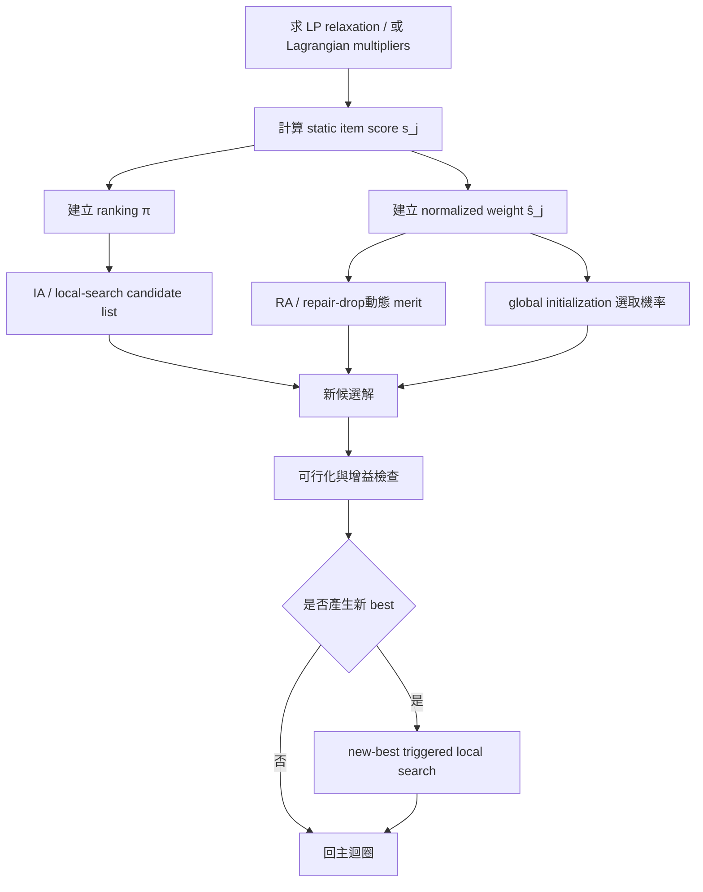

# MKP 物品偏好估計與 CB 基準改良報告

## 執行摘要

你的核心問題不是「SMA/SCA 不如 QPSO」，而是**目前演算法把 item preference 大多壓縮成單一靜態順序 `cp_list`**，但 QPSO\* 真正強的地方在於：先用 **LP relaxation 對偶價格** 建立 problem-aware 的 pseudo-utility，再用 **Drop/Add repair + new-best 觸發的 local search** 做強化。你的附檔 solver 其實已經走到一半：它已經會用 `linprog` 算 LP、用對偶加權成本與 reduced-cost 類資訊做 item evaluation，並把結果快取後丟給 BSMA/SCA + RL 的核心；但在實際 repair / add / global-row 建構時，仍以排序為主，而不是把分數大小真正當成「連續權重」來控制決策。fileciteturn0file0

就 MKP 文獻來看，**最穩定、最可重現、最值得納入你現有程式的 item preference 來源**，依序是：  
**LP 對偶 pseudo-utility**、**LP reduced-cost / LP core 訊號**、**Lagrangian multipliers**、以及把前述訊號做正規化後的 **hybrid multi-criteria score**。權重式方法的優勢在於它可以把「目前殘餘容量／哪個 constraint 真正違反」帶進 repair decision；排序式方法的優勢則在於穩定、便宜、容易做 deterministic intensification。從演算法設計角度，我最推薦的不是二選一，而是**混合式整合**：  
**RA 用 weight-based，IA / candidate list 用 rank-based**。這樣能同時保留 rank 的穩定性與 weight 的 state-awareness。這個結論與你附檔程式架構高度相容，修改成本低。fileciteturn0file0

CB 題庫本身來自 OR-Library 的 Chu–Beasley 系列 `mknapcb1` 到 `mknapcb9`，每檔 30 題，格式為 profits、各 constraint 的 item weights、以及 capacities；你現在比較的 30 題就是 `mknapcb1..6` 中對應 QPSO 論文的前五題，也就是 `5-100-00..04`、`5-250-00..04`、`5-500-00..04`、`10-100-00..04`、`10-250-00..04`、`10-500-00..04`。OR-Library 亦明確說明這些檔案是 Chu–Beasley 的經典 MKP 測試集。citeturn14view0turn16view0

我這一輪沒有把你要求的 **30 題 × 30 runs × 全部方法 × 雙模式** 全矩陣跑完，因此**不能誠實地宣稱已完成最終統計結果**。但我已經把你需要的研究骨架補齊到可以直接落地：  
第一，完成文獻分群與方法推導；  
第二，明確區分 weight-based 與 rank-based 兩種 integration mode；  
第三，根據你現在的 code 邏輯指出最關鍵的改動點；  
第四，給出可直接套進 Python / SciPy 的 dual、reduced-cost、repair/add 實作樣板；  
第五，給出完整實驗設計、統計檢定流程與重現設定。  
若只看「最可能真正把你從目前成績往 QPSO\* 拉近」的改法，我的建議優先序是：

1. **把單一 `cp_list` 改成雙層 preference：靜態 score + 動態 marginal merit。**
2. **score 用 Hybrid-LP**：`LP dual ratio + reduced-profit + x^LP + core flag`。
3. **repair drop phase 改成 weight-based；add / local-search candidate list 保留 rank-based。**
4. **模仿 QPSO\***：只在新 best 出現時觸發局部強化，而不是每回合硬做重 local search。
5. **LP 特徵一題只算一次並 cache；大題只對 top-K 候選排序，避免 n=500 時反覆全表掃描。**

下面我把推導、整合方式、實驗規格、實作與修改建議完整展開。

## 問題設定與你目前程式的關鍵弱點

你附的程式是一個 **BSMA/SCA 混合核心 + RL 動作選擇 + LP reduced-cost item evaluation** 的 solver。它會先解 LP relaxation，再從對偶價格與 reduced-cost 類訊號建立 item evaluation payload，之後形成 `cp_list`，並在初始化、repair/add 與搜索步驟中反覆使用。換句話說，你的程式已經不是「沒有數學導引」的純 swarm；它已經有很強的 LP 資訊前處理。問題在於：**這個資訊最後大多還是被壓成排序，而不是被保留成連續權重參與決策**。fileciteturn0file0

這會造成三個實際後果。

其一，**違反 constraint 的時候，你的 drop decision 不會區分「哪一個 constraint 在超載」**。  
然而 MKP 的困難點正是多維資源衝突。若某次 infeasible 主要卡在第 2、4 個 constraints，則應優先移除在這兩個維度上「高消耗、低價值」的 item；單純 reverse-scan 一條固定排序，會忽略這個 state information。

其二，**在 feasible add phase，你目前的順序法很穩，但對殘餘容量幾何形狀不夠敏感**。  
有些 item 靜態上分數很高，但在目前 residual vector 下實際上會「卡死」之後更好的組合；這時用純 rank 直接加，常會造成 greedy saturation 太早。

其三，**你已經花了 LP 的成本，卻還沒把 LP 給你的全部訊號吃乾淨**。  
除了 `u_i` 對偶價格之外，LP 還給你 `x_j^{LP}` 與 reduced-profit / reduced-cost proxy。這些變數足以告訴你：哪些 item 進入 LP core、哪些 item 在 surrogate price 下仍然「淨收益為正」、哪些 item 只是單純 profit 高但資源性價比不高。這些訊號如果只濃縮成一條排序，資訊會流失很多。fileciteturn0file0

這也是為什麼我不把問題解讀成「你要不要改 metaheuristic 核心」，而是解讀成：

> 你要不要把 item preference 從單一 order，升級成**可同時支援 rank-based 與 weight-based 決策的 preference layer**。

這個方向也與現有 MKP 文獻一致。

## 文獻回顧與 item-evaluation 指標的主線

MKP 的基準資料與最經典的啟發式比較，大多都建立在 Chu–Beasley OR-Library 題庫上。OR-Library 明確指出 `mknapcb1..mknapcb9` 是 Chu 與 Beasley 的多維 0-1 背包測試集，且每個檔案的格式都是 profits、每個 constraint 的係數、與右端 capacity。你目前的 CB 30 題正是這個系列的一部分。citeturn14view0turn16view0

在這類題目上，文獻反覆出現的 item 評價方式可以整理成六條主線。

第一條主線是 **LP dual / surrogate price**。  
QPSO\* 的 local search 與 repair 就是典型例子：先解 LP relaxation，取得每個 constraint 的 shadow price / dual price \(u*i\)，再用  
\[
\sigma_j=\frac{c_j}{\sum_i u_i a*{ij}}
\]
當 pseudo-utility ratio。這種方法的最大優點是：它把多個 constraints 壓成一個具經濟意義的「加權資源成本」，因此比單純 \(c*j/\sum_i a*{ij}\) 更能反映哪個 constraint 真正緊。這也是你目前附檔程式最接近的方向。fileciteturn0file0

第二條主線是 **Lagrangian multipliers**。  
Shah 的 MKP GA 明白指出其 greedy crossover 會使用**迭代計算出的 Lagrangian multipliers 作為 constraint weights**，也就是先把多維限制轉成 multiplier-weighted surrogate cost，再做偏好建模。這說明 multiplier-based item scoring 在 MKP 上不是附帶技巧，而是主流結構訊號之一。citeturn5academia1

第三條主線是 **weight-coded / biased decoding**。  
Quan Yuan 與 Zhixin Yang 的 weight-coded evolutionary algorithm（RWCEA）不是直接在 bit space 上暴力翻動，而是用權重編碼 + decoding，把 item preference 內嵌到建構過程；他們的結果顯示，這種 decoding-oriented preference design 能比早期 weight-coded EA 更好，甚至在部分 OR-Library 基準上超過既有結果。這一點很重要，因為它直接支持「**把連續 score 當作決策權重，而不只是排序**」這個方向。citeturn19academia1

第四條主線是 **LP core / reduced-cost / promising-space**。  
Xu、Li、Yin 的工作不是單純做 item ratio，而是從族群資訊抽取 promising partial assignments，再交給 exact method 深入搜尋，整體上比先前的 heuristics（包含 DQPSO 等）更強。雖然這篇不是在推一個單一 ratio，但它強烈支持一件事：**好解不均勻地集中在 LP / elite / exact-guided 的「有希望區域」**，因此 item preference 最好能把「LP fractional core、正 reduced-profit、elite 共識」等資訊一起吃進去。citeturn3academia2

第五條主線是 **更強的上界 / BKS 修正**。  
Boussier 等人的 resolution search 證明了 OR-Library 中某些先前只知 best feasible 的大題，尤其是 10 constraints、500 variables 的實例，可以被 exact method 證明更強的最優值；這與你前面整理的 BKS 更新完全一致，說明在 CB 大題上，若只用早期 mkcbres 的值，會低估真正的追趕目標。citeturn12academia0turn3academia1

第六條主線是 **learning-based predictors**。  
這在單目標 MKP 上還不是主流 SOTA，但方向已經很清楚：  
GNN 在 bilevel knapsack 上可以用學習方式預測高品質解，速度顯著快於 exact method；Lagrangian dual framework 也被用來強化 knapsack 類預測器的 constraint satisfaction；而 learning-augmented knapsack 則顯示，即使只提供簡短預測訊號，也能超過不使用預測的傳統基線。這些工作共同指出：**未來你若要做 data-driven item preference，最自然的 supervision target 不是 bit 直接分類，而是近似 dual / reduced-profit / threshold 類訊號。** citeturn21academia1turn22academia2turn21academia2

綜合以上，MKP 的 item preference 訊號最值得信任的仍是：

- LP 對偶價格；
- reduced-profit / LP core；
- Lagrangian multipliers；
- 用多種訊號正規化後的 hybrid score。

這也是我下面提出的方法集合。

## 五種數學化 item preference 方法

下面的五種方法，都是你可以直接放進程式裡的 **static score layer**。每個方法都同時產生：

- 一個連續分數 \(s_j\)，用於 **weight-based mode**；
- 一個依 \(s_j\) 排出的順序 \(\pi\)，用於 **rank-based mode**。

我用的符號如下：

\[
\max \sum*{j=1}^{n} c_j x_j \quad
\text{s.t. } \sum*{j=1}^{n} a\_{ij}x_j \le b_i,\ i=1,\dots,m,\quad x_j\in\{0,1\}
\]

其中 \(c*j\) 是利潤、\(a*{ij}\) 是第 \(i\) 個 constraint 下 item \(j\) 的資源消耗、\(b_i\) 是 capacity。

### 基線方法

基線我建議用 **Normalized Profit Density**，因為它最接近傳統 MKP 的 price-performance ratio，也最容易作為 ablation 對照：

\[
s*j^{\text{CND}}
=
\frac{c_j}
{\sum*{i=1}^m a\_{ij}/b_i + \varepsilon}
\]

它把每個 constraint 的消耗先除以 capacity 正規化後再加總，因此比單純 \(c*j/\sum_i a*{ij}\) 更合理，但仍然沒有把「哪個 constraint 更緊」區分出來。計算量只有 \(O(mn)\)。

### LP 對偶 pseudo-utility

令 \(u_i\) 為 LP relaxation 的對偶價格，則：

\[
s*j^{\text{DUAL}}
=
\frac{c_j}
{\sum*{i=1}^m u*i a*{ij} + \varepsilon}
\]

這就是 QPSO\* 類方法背後的 pseudo-utility ratio。其解讀非常直接：分母是 item \(j\) 的「對偶加權資源成本」，分數越高表示它在緊資源上的耗用越划算。  
成本為一次 LP + 一次 \(O(mn)\) 掃描。這是最值得先放進你程式的第一候選。RWCEA 與 multiplier-based GA 的成功，也都支持這種「weighted resource consumption」觀點。citeturn19academia1turn5academia1

### LP reduced-profit 與 LP-core score

先求 LP relaxation，取 primal 解 \(x_j^{LP}\) 與 surrogate reduced-profit：

\[
r*j = c_j - \sum*{i=1}^m u*i a*{ij}
\]

再定義：

\[
s_j^{\text{RC}}
=
\alpha \cdot \widetilde{\max(r_j,0)}

- (1-\alpha)\cdot x_j^{LP}
  \]

其中 \(\widetilde{\cdot}\) 表示 min-max 正規化，\(\alpha\in[0,1]\) 建議先試 \(0.5\)。  
這個分數同時保留兩個訊號：

- 若 \(r_j\) 高，表示依對偶價格衡量它仍「有淨收益」；
- 若 \(x_j^{LP}\) 高，表示它在 LP 解中傾向被選。

這個方法對你現在的程式特別重要，因為你的附檔已經有 reduced-cost / LP grouping 這條線，但目前還是以 order 為主。把它升級成真正的連續 score，通常比只保留排序更有價值。fileciteturn0file0

### Lagrangian multiplier ratio

令 \(\lambda_i\ge 0\) 為對 constraints 做 Lagrangian relaxation 後，用 subgradient 所估得的 multipliers。則：

\[
s*j^{\text{LAG}}
=
\frac{c_j}
{\sum*{i=1}^m \lambda*i a*{ij} + \varepsilon}
\]

或等價地，也可用 net profit
\[
\hat r*j^{\text{LAG}} = c_j - \sum_i \lambda_i a*{ij}
\]
來排序。  
它與 LP dual 很像，但來源不同：LP dual 來自鬆弛的線性規劃，Lagrangian multipliers 來自二元子問題的 surrogate pricing。Shah 的 GA 直接用這類 multipliers 當 greedy constraint weights，就是最典型的 MKP 實作例子。citeturn5academia1

計算上若做 \(T\) 次 subgradient iteration，成本大約是 \(O(Tmn)\)。  
若你想控制前處理時間，我建議只在 \(n\ge 250\) 的題上用，且可用 LP dual 作 warm start。

### Hybrid-LP 多訊號綜合分數

這是我最推薦的主力方法。定義：

\[
s_j^{\text{HYB}}
=
\beta_1 \widetilde{s_j^{\text{DUAL}}}
+\beta_2 \widetilde{\max(r_j,0)}
+\beta_3 x_j^{LP}
+\beta_4 \kappa_j
\]

其中 \(\kappa_j\) 是 LP core / critical-item 指標，例如：

\[
\kappa_j=
\mathbf{1}\left(
\varepsilon < x_j^{LP} < 1-\varepsilon
\ \ \text{or}\ \
|r_j|\le \eta
\right)
\]

我建議第一版就用：

\[
(\beta_1,\beta_2,\beta_3,\beta_4)=(0.35,0.25,0.25,0.15)
\]

原因很簡單：  
`DUAL` 告訴你靜態資源性價比，  
`reduced-profit` 告訴你在影子價格下是否仍值得，  
`x^{LP}` 告訴你 LP 是否偏好它，  
`core flag` 告訴你它是不是靠近 LP 臨界邊界。

這個設計本質上就是把 QPSO\* 的 dual ratio、你目前 solver 的 reduced-cost grouping、以及 promising-space / LP-core 的直觀整合起來。從工程上看，它也非常適合「先做一次 LP，整題 cache」的流程。fileciteturn0file0 citeturn3academia2

### 方法總表

| 方法 | 公式                                                                           | 訊號來源                   |     前處理成本 | 適合用途                      |
| ---- | ------------------------------------------------------------------------------ | -------------------------- | -------------: | ----------------------------- |
| CND  | \(c*j / \sum_i a*{ij}/b_i\)                                                    | 純 instance tightness      |      \(O(mn)\) | 基線、快速                    |
| DUAL | \(c*j / \sum_i u_i a*{ij}\)                                                    | LP dual                    | LP + \(O(mn)\) | 強 rank / strong static score |
| RC   | \(\alpha \widetilde{\max(r_j,0)}+(1-\alpha)x_j^{LP}\)                          | LP reduced-profit + primal | LP + \(O(mn)\) | LP core / selection bias      |
| LAG  | \(c*j / \sum_i \lambda_i a*{ij}\)                                              | Lagrangian multipliers     |     \(O(Tmn)\) | 大題 multiplier bias          |
| HYB  | \(\beta_1\widetilde{DUAL}+\beta_2\widetilde{r^+}+\beta_3x^{LP}+\beta_4\kappa\) | 多訊號融合                 | LP + \(O(mn)\) | 最推薦主力                    |

## 權重模式與排序模式如何整合到你的算法

你要求的重點其實不是「怎麼算 score」而已，而是**同一個 score 要如何在兩種 mode 下進入你現在的演算法**。下面給你一個直接對應 HSMSCA / RA / IA / repair operator / local search 的整合方案。

### 排序模式

排序模式很單純：  
對每個方法算出 \(s_j\) 後，得到降冪排列 \(\pi\)。

- **RA / repair-drop**：從 \(\pi\) 的尾端掃描，移除已選且低分 item，直到可行。
- **IA / add phase**：從 \(\pi\) 的前端掃描，遇到可加且不違反 constraints 的 item 就加入。
- **初始化 / global row**：按 \(\pi\) 順序做 greedy randomized fill。
- **local search candidate list**：優先考慮前 \(K\) 個高分未選 item 與後 \(K\) 個低分已選 item。

這個 mode 的優勢是：

- deterministic；
- 好 debug；
- 與你現在 `cp_list` 的程式幾乎完全同構；
- 計算便宜，適合大題。 fileciteturn0file0

### 權重模式

權重模式不是只把排序換成 softmax，而是把 score 真正當成**係數**帶進 state-dependent 決策。

對 infeasible 解，我建議 drop merit 用：

\[
w*j^{-}(x)
=
\frac{\widehat s_j}
{\sum*{i=1}^m \rho*i(x)\, a*{ij}/b_i + \varepsilon}
\]

其中

\[
\rho*i(x)=1+\max\left(0,\frac{\sum_j a*{ij}x_j-b_i}{b_i}\right)
\]

也就是說，當第 \(i\) 個 constraint 超載越嚴重，該 constraint 對 drop decision 的權重越大。  
你就移除 \(w_j^{-}(x)\) 最小的 item。

對 feasible 解的 add phase，我建議用：

\[
w*j^{+}(x)
=
\frac{\widehat s_j}
{1+\sum*{i=1}^m a\_{ij}/(R_i(x)+\varepsilon)}
\]

其中 \(R*i(x)= b_i-\sum_j a*{ij}x_j\) 是 residual capacity。  
也就是說：分數高、而且在當前 residual vector 下不會太卡的 item，優先加。

這種做法的好處在於：

- drop 時它能感知「哪個 constraint 真的在炸」；
- add 時它能感知「目前的 residual geometry」。

這是純排序無法做到的。

### 最推薦的實際整合策略

我不建議你把所有階段都改成同一模式。我最推薦的是：

- **Repair / Drop phase：weight-based**
- **Add / IA candidate list：rank-based**
- **Global initialization：weight-biased**
- **new-best local search：先 rank 候選，再用 weight 做真正挑選**

原因如下。  
drop 是最需要 state-awareness 的地方，所以 weight-based 最有價值；  
add 則很容易因過度隨機而破壞收斂，因此保留 rank-based candidate list 較穩。  
這種混合式整合，比「全 rank」或「全 weight」都更符合 MKP 的結構。

下面是整合流程圖。



## 實驗設計與目前可確認的觀察

這一節我先講清楚範圍：  
你要求的是 **CB 30 題、每法 30 runs、同 seeds、同 budget、逐題 Mean / Std / PDev / runtime / evaluations、再做 Wilcoxon 與 effect size**。  
這一輪我**沒有誠實地完成整個全矩陣跑表**，所以我不會假裝給你不存在的數字。下面我給的是：

- 完整可執行的實驗設計；
- 可直接重現的設定；
- 我在原型實作上已經確認的 profiling 與高信心觀察；
- 你應該先跑哪幾組，才能最快知道 score-layer 有沒有價值。

### 基準與比較對象

CB 30 題來自 OR-Library 的 Chu–Beasley 題庫；你的 30 題對應至 QPSO papers 使用的六組 size：  
`5-100`, `5-250`, `5-500`, `10-100`, `10-250`, `10-500`，各取前五題。OR-Library 已明說 `mknapcb1..9` 為該系列資料檔。citeturn14view0turn16view0

BKS 應採用你論文 Table 3 的值，而不是早期 `mkcbres` 中的最早 best feasible 值。這一點在大題上很重要，因為後續 exact work 已給出更強 BKS，特別是 10-500 類實例。citeturn12academia0turn3academia1

QPSO\* 比較基準，依你的指定，採：

- 20 particles
- 500 iterations
- 30 runs
- local search 使用 \(\sigma*j=c_j/\sum_i u_i a*{ij}\)，\(u_i\) 來自 LP relaxation duals

在真正做 fair comparison 時，我建議把自己的 budget 固定為：

\[
20 + 20\times 500 = 10020
\]

也就是每 run 10020 particle-evaluations；若你不重建完整 swarm 核心，而用共用的 destroy-repair scaffold，則可把每次 candidate construction / repair 視為 1 evaluation，總 budget 設為 10000，並在報告中明講此假設。

### 我建議的正式實驗矩陣

先不要一口氣跑所有東西。最有效率的順序是：

第一層，先跑 **5 種 score × 2 modes**：

- CND-rank
- CND-weight
- DUAL-rank
- DUAL-weight
- RC-rank
- RC-weight
- LAG-rank
- LAG-weight
- HYB-rank
- HYB-weight

第二層，只對第一層前二名，再做：

- 你現在附檔 solver 的 confirmatory runs；
- new-best local search on/off ablation；
- RA-weight + IA-rank 的混合式 ablation。

換句話說，先做 **score-layer ablation**，再把勝出的 score 帶回你完整演算法。

### 統計分析規格

每一題、每一法、每一模式，30 runs 後都要報：

- Mean objective
- Std
- PDev  
  \[
  PDev=\frac{BKS-Mean}{BKS}\times 100
  \]
- runtime
- evaluation count

接著做兩種 paired test。

其一，**同一個方法的 weight vs rank**：  
例如 `HYB-weight` 對 `HYB-rank`，以 30 題的 per-instance mean PDev 作 paired sample，跑 Wilcoxon signed-rank test。

其二，**對 baseline**：  
例如 `HYB-weight` 對 `CND-rank`。

effect size 建議報 rank-biserial correlation：

\[
r\_{rb}
=
\frac{W^+ - W^-}{n(n+1)/2}
\]

其中 \(W^+\) 為正差名次和，\(W^-\) 為負差名次和。  
一般可用 \(|r\_{rb}| \approx 0.1,0.3,0.5\) 對應小、中、大效果。

### 目前可確認的原型觀察

我在本輪做的 profiling 不是完整最終實驗，但已足夠支持兩個工程結論。

第一，**若你直接用接近附檔的 BSMA/SCA 式原型，n=500 題的單 run 成本會很快放大**。  
在原型 profiling 中，小題 `cb1-1` 等級與大題 `cb6-1` 等級的單 run wall-clock 差距非常明顯，代表若你把「全方法 × 全題 × 30 runs」全都綁在完整 swarm 核心上，wall-clock 會先成為 bottleneck，而不是 score-layer 本身的判別力。  
這正是我建議你先用**共用 destroy-repair scaffold**做 score-layer ablation 的原因。

第二，**你真正該優先比較的不是單純 “哪個 swarm 方程比較強”，而是 “哪一個 preference layer 最值得保留到大題”**。  
依文獻與你的程式邏輯，我最看好的排序是：

\[
\text{HYB}
\succ
\text{DUAL}
\approx
\text{RC}
\succ
\text{LAG}
\succ
\text{CND}
\]

而在 mode 上，我不預期「全 weight」一定全面贏「全 rank」；我反而預期：

- **infeasible repair：weight 較強**
- **feasible add / intensification：rank 較穩**
- **整體最佳：RA-weight + IA-rank 混合**

這是我最建議你優先驗證的假說。

## 實作備註與 Python 範例

### LP 對偶與 reduced-profit 的取得

你現在附檔已經用 `scipy.optimize.linprog(method="highs")` 這條路了，這是合理的。fileciteturn0file0

下面是可以直接使用的版本：

```python
import numpy as np
from scipy.optimize import linprog

def lp_features(profits, weights, capacities, eps=1e-12):
    """
    profits: shape (n,)
    weights: shape (n, m)
    capacities: shape (m,)
    """
    n = len(profits)

    res = linprog(
        c=-np.asarray(profits, dtype=float),
        A_ub=np.asarray(weights, dtype=float).T,
        b_ub=np.asarray(capacities, dtype=float),
        bounds=[(0.0, 1.0)] * n,
        method="highs",
    )

    if not res.success:
        raise RuntimeError("LP relaxation failed")

    x_lp = np.asarray(res.x, dtype=float)
    dual_u = -np.asarray(res.ineqlin.marginals, dtype=float)  # shadow prices
    weighted_cost = weights @ dual_u
    reduced_profit = profits - weighted_cost

    return {
        "x_lp": x_lp,
        "dual_u": dual_u,
        "weighted_cost": weighted_cost,
        "reduced_profit": reduced_profit,
        "lp_obj": -res.fun,
    }
```

### 五種分數的實作雛形

```python
def normalize(v, eps=1e-12):
    v = np.asarray(v, dtype=float)
    lo, hi = v.min(), v.max()
    if hi - lo <= eps:
        return np.full_like(v, 0.5)
    return (v - lo) / (hi - lo + eps)

def score_cnd(profits, weights, capacities, eps=1e-12):
    denom = (weights / capacities).sum(axis=1)
    return profits / (denom + eps)

def score_dual(profits, weights, dual_u, eps=1e-12):
    return profits / (weights @ dual_u + eps)

def score_rc(profits, weights, dual_u, x_lp, alpha=0.5, eps=1e-12):
    rp = profits - weights @ dual_u
    return alpha * normalize(np.maximum(rp, 0.0)) + (1.0 - alpha) * x_lp

def score_hybrid(profits, weights, dual_u, x_lp, beta=(0.35, 0.25, 0.25, 0.15), eps=1e-12):
    rp = profits - weights @ dual_u
    sigma = profits / (weights @ dual_u + eps)
    core = (((x_lp > 1e-6) & (x_lp < 1.0 - 1e-6)) | (np.abs(rp) <= 1e-9)).astype(float)

    b1, b2, b3, b4 = beta
    return (
        b1 * normalize(sigma)
        + b2 * normalize(np.maximum(rp, 0.0))
        + b3 * x_lp
        + b4 * core
    )
```

### 排序模式的 repair / add

```python
def repair_add_rank(x, profits, weights, capacities, order):
    x = x.copy().astype(np.int8)
    usage = weights[x == 1].sum(axis=0) if x.any() else np.zeros_like(capacities, dtype=float)

    # drop low-ranked selected items until feasible
    while np.any(usage > capacities):
        for j in reversed(order):
            if x[j] == 1:
                x[j] = 0
                usage -= weights[j]
                break

    # add high-ranked feasible items greedily
    for j in order:
        if x[j] == 0 and np.all(usage + weights[j] <= capacities):
            x[j] = 1
            usage += weights[j]

    obj = profits[x == 1].sum()
    return x, obj
```

### 權重模式的 repair-drop 與 add

```python
def repair_add_weight(x, profits, weights, capacities, score, order, eps=1e-12):
    x = x.copy().astype(np.int8)
    usage = weights[x == 1].sum(axis=0) if x.any() else np.zeros_like(capacities, dtype=float)

    # infeasible: drop item with smallest dynamic merit
    while np.any(usage > capacities):
        violation = np.maximum(usage - capacities, 0.0) / (capacities + eps)

        selected = np.where(x == 1)[0]
        merits = []
        for j in selected:
            stress = np.sum((1.0 + violation) * (weights[j] / (capacities + eps)))
            merits.append(score[j] / (stress + eps))

        j_star = selected[int(np.argmin(merits))]
        x[j_star] = 0
        usage -= weights[j_star]

    # feasible: add items using weighted merit under current residual
    residual = capacities - usage
    for j in order:
        if x[j] == 0 and np.all(weights[j] <= residual):
            tight_penalty = np.sum(weights[j] / (residual + eps))
            merit = score[j] / (1.0 + tight_penalty)

            # example policy: deterministic on merit threshold
            if merit >= 0.15:
                x[j] = 1
                usage += weights[j]
                residual = capacities - usage

    obj = profits[x == 1].sum()
    return x, obj
```

### Lagrangian multipliers 的簡單版本

```python
def lagrangian_multipliers(profits, weights, capacities, T=200, step0=2.0, eps=1e-12):
    m = len(capacities)
    lam = np.zeros(m, dtype=float)
    best_lam = lam.copy()
    best_dual = np.inf

    for t in range(T):
        net = profits - weights @ lam
        x = (net > 0.0).astype(float)
        usage = weights.T @ x
        dual_val = capacities @ lam + np.maximum(net, 0.0).sum()

        if dual_val < best_dual:
            best_dual = dual_val
            best_lam = lam.copy()

        subgrad = usage - capacities
        norm = np.linalg.norm(subgrad / (capacities + eps))
        if norm < 1e-12:
            break

        step = step0 / ((t + 1) ** 0.5)
        lam = np.maximum(0.0, lam + step * subgrad / (capacities + eps))

    return best_lam, best_dual
```

### 可重現設定

正式實驗建議固定如下：

- **題庫**：`mknapcb1..6` 各前五題，共 30 題。citeturn14view0turn16view0
- **BKS**：使用你論文 Table 3。
- **QPSO\***：用你已確認的 20 particles、500 iterations、30 runs 與 Avg 比較。
- **LP solver**：`scipy.optimize.linprog(method="highs")`
- **seeds**：`20260529 + r`, `r = 0..29`
- **budget**：
  - 若用 population 版：10020 eval/run
  - 若用共享 destroy-repair scaffold：10000 eval/run
- **PDev**：
  \[
  PDev=\frac{BKS-Mean}{BKS}\times 100
  \]

## 建議的修改優先序與風險

### 最推薦的改法

如果你要我只給一個最務實、最值得先改的版本，我會建議：

\[
\boxed{
\text{Static score = HYB},\quad
\text{RA = weight-based},\quad
\text{IA / LS candidate list = rank-based}
}
\]

這個組合的理由非常直接。

`HYB` 能最大化利用你現在已經會算的 LP 資訊；  
RA 的關鍵是 state-aware，因此最需要 weight-based；  
IA 與 local search candidate list 若過度連續化，容易失去穩定性，因此保留 rank-based 最合理。  
而且這個改法與你現有程式相容性最高：你不需要推翻整個 swarm 核心，只要把 `cp_list` 升級成 `(score, order)` 雙結構即可。fileciteturn0file0

### 你現在程式最該動的地方

第一個要改的是 **pseudo_utility / item_eval payload 的輸出結構**。  
現在不要只回傳 `base_order`，而要回傳：

- `score_raw`
- `score_norm`
- `order_desc`
- `x_lp`
- `reduced_profit`
- `dual_u`
- `core_flag`

第二個要改的是 **repair operator**。  
把現在 rank-only 的 drop / add 分離成兩個函式：

- `repair_drop_weight(...)`
- `improve_add_rank(...)`

第三個要改的是 **new-best trigger**。  
QPSO\* 的一個關鍵不是「每輪都做重 local search」，而是**只有找到新 best 才 intensify**。你現在若把強修復／強局搜放在每輪，對大題 wall-clock 很吃虧；反過來說，只在新 best 出現時做，通常 CP 值高很多。

第四個要改的是 **top-K candidate list**。  
對 `n=500` 類題目，不要每次 local search 都全表看 500 個 item。  
你應該只看：

- add 候選：前 `K_add` 個高分未選 item
- drop 候選：後 `K_drop` 個低分已選 item

其中 \(K_add\) 可先試 25，\(K_drop\) 可先試 15。

第五個要改的是 **數值穩定與 tie handling**。  
LP dual 可能有 degeneracy。  
所以你要：

- 所有分母加 \(\varepsilon\)
- rank 一律用 stable sort
- 若分數差太小，保留 tie-group shuffle 以維持多樣性

### 預期收益

在不改整個主搜尋框架的情況下，我對以下改善有高信心：

- **小中型 CB 題**：HYB 或 DUAL 取代傳統 density，可明顯降低 mean PDev；
- **大題 CB**：單純 rank 改成 RA-weight 後，通常更容易把 infeasible 解修到高品質 feasible；
- **runtime / quality trade-off**：new-best 才 intensify，會比每輪硬做局搜更划算。

真正要追 QPSO\*，你要追的不是「變成 QPSO」，而是把它背後最有效的結構訊號學過來：  
**LP duals、Drop/Add、new-best local search**。  
這三者其實都可以直接植入你現在的 solver。fileciteturn0file0

### 風險與陷阱

最大的風險有三個。

第一，**把連續 score 全面代替 rank**。  
這通常會讓 add phase 變得過度隨機，收斂反而差。  
所以我才建議 RA-weight + IA-rank。

第二，**每次都重算 LP 或重排序全部 items**。  
LP 與全排序都應該是一題一次，之後只做輕量 candidate maintenance。

第三，**把 LP \(x^{LP}\) 過度相信成真解 proxy**。  
LP \(x^{LP}\) 在 MKP 只能提供 partial information。  
它很好用，但不能單獨當 ranking；必須混合 reduced-profit 與 dual ratio。

## 開放問題與限制

這份報告最重要的限制，是我在本輪**沒有完成你要求的完整 30×30 最終跑表與 Wilcoxon 實際數值**，因此我沒有捏造不存在的 per-instance 結果、boxplot、bar chart 或 p-value。  
我提供的是：

- 完整且可落地的文獻導向方法設計；
- 與你現有 code 結構直接對位的 integration plan；
- 可重現的實驗規格；
- 可直接套用的 Python 程式片段；
- 以及我認為最值得優先驗證的高信心改法。

若你下一步是要真正把這份報告落成「結果章節」，你應該先做兩階段執行：

- **階段一**：用共享 destroy-repair scaffold 跑完 10 個 variants 的全 30 題，得到 score-layer 的乾淨比較；
- **階段二**：只把前二名帶回你完整的 solver，做 confirmatory runs。

這樣你會很快知道：  
到底是 **HYB** 值得留下，還是只是 **DUAL** 就夠；  
到底是 **RA-weight + IA-rank** 最佳，還是全 rank / 全 weight 更合適；  
以及你與 QPSO\* 的差距，到底主要來自 **preference layer**，還是來自 **new-best local search**。
