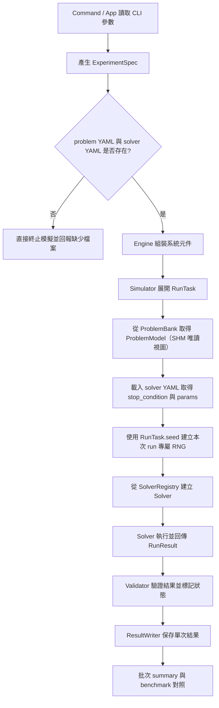
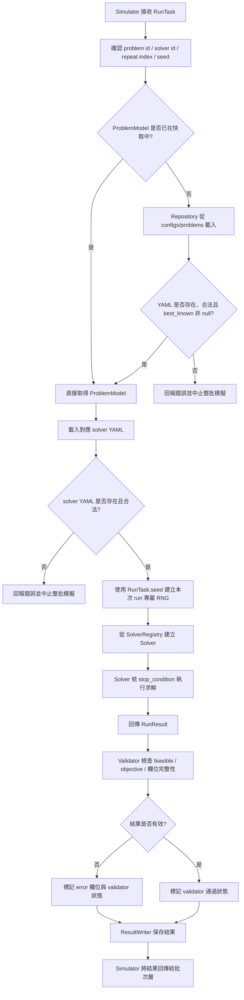
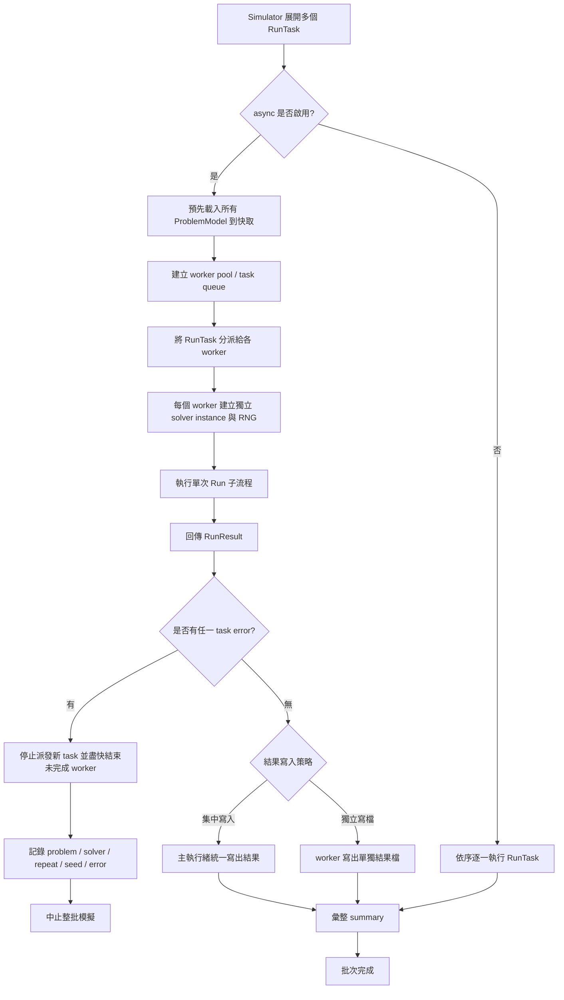
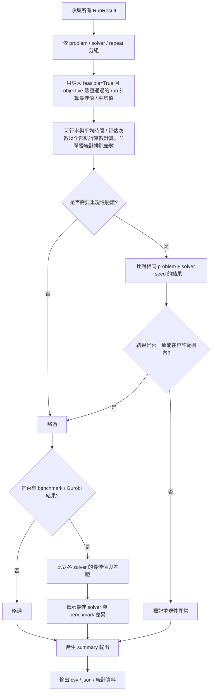

# mkp 模擬系統規劃

## 1. 模擬系統流程規劃

### 系統目標

本系統的核心目標，是將目前以資料集專用腳本為核心的 MKP 實驗程式，
重構為一個可重現、可維護、可批次執行、且後續容易優化的實驗系統。
第一優先不是單點加速，而是先解決目前「題庫解析、演算法邏輯、實驗排程、結果輸出彼此耦合」的問題。

因此系統目標需要分階段定義，避免第一版同時承擔過多工作，導致架構與優化策略混在一起。

#### 第一階段目標

第一階段的目標是先建立一個正確、穩定、可重現的實驗框架，讓現有 MKP 演算法可以被一致地接入與執行。

1. 建立統一的問題定義層。
系統應能將不同來源與不同格式的題庫，轉換為一致的 `ProblemModel`，
使題庫解析與演算法執行分離，避免每個入口腳本重複實作讀檔與轉換邏輯。

2. 建立統一的求解器介面。
系統應定義一致的 solver 契約，例如輸入 `ProblemModel`、solver 設定（含終止條件）、seed，輸出 `RunResult`。演算法本身只負責求解流程，不直接負責題庫讀取、實驗排程與輸出寫檔。

3. 建立統一的實驗規格與執行流程。
系統應能用一致的 `ExperimentSpec` 描述 problem、solver、seed、重複次數與輸出位置，
並保證在相同輸入條件下得到可重現的結果。

4. 建立標準化的結果輸出與統計層。
系統應統一保存每次執行的最佳值、最佳解、可行性、執行時間、
評估次數、停止條件、題目識別資訊、solver 參數與 seed，
使後續分析、畫圖與論文整理不依賴個別腳本的輸出格式。

5. 建立最小可用的驗證能力。
第一階段至少要能驗證題庫解析正確性、可行性檢查、目標值計算、
seed 重現，以及重構前後在代表性題目上的結果一致性，
確保系統重構後的正確性不退化。

#### 第二階段目標

第二階段的目標是在第一階段架構穩定後，再處理吞吐量與熱路徑效能問題。

1. 建立批次模擬與並行執行能力。
系統應支援以實驗任務為單位，批次執行多個題目、多次重複模擬、
多組演算法比較，並可在可控資源下平行化執行，以提升整體吞吐量。

2. 建立低額外成本的執行模型。
系統應避免在熱路徑中反覆做題庫解析、物件建立與大型陣列重配，
透過靜態資料快取、可重用狀態與明確的 mutable state 邊界，
降低記憶體壓力並提升長時間批次實驗的穩定性。

3. 建立基準比對能力。
系統應能在指定 benchmark 題目上，與 Gurobi 等精確方法的結果進行對照，
作為回歸驗證與效能分析的基準，而不是要求所有流程都依賴精確解。

4. 建立 Converter 命令化與多題庫 parser 擴充能力。
在第一階段已完成 Converter 核心與註冊機制後，第二階段補上 CLI 參數化（可指定 dataset/problem/converter），
並逐步擴充不同題庫格式（例如 OR5x500、PB2）的專屬 parser 與批次轉檔流程。

#### 長期延伸目標

在 MKP 版本穩定後，再考慮更高層級的泛化能力。

1. 建立問題模型與求解演算法的解耦架構。
系統應使相同的實驗框架可以支援不同優化問題，
並使相同求解器的共通部分能在不同問題模型上重複使用，
為後續從 MKP 擴展到其他組合優化問題保留空間。

#### 判斷目前目標是否完整的標準

如果第一階段完成後，系統已經能滿足下列條件，則代表目標設計大致完整：

1. 新增一個題庫格式時，只需要新增 parser 函數，不需要修改 solver 邏輯。
2. 新增一個 solver 時，只需要實作 solver 介面，不需要修改實驗主流程。
3. 相同 problem、solver、seed、參數下，可以穩定重現結果。
4. 同一批實驗可以用一致格式輸出，並能直接做後續統計分析。
5. 系統重構後，可以用少量 benchmark 題目驗證正確性沒有退化。

### 執行命令規劃

`題庫轉換命令指令`: 將目前 data 中的原始 txt / dat 題庫轉換成標準 yaml，保存到 `configs/problems/<dataset>/<problem_id>.yaml`。這是模擬執行前的前置步驟，不應在模擬主流程中動態進行。

`建立命令指令`: 所有實驗參數均由 CLI 直接指定，包含 dataset、problem、solver、repeat、seed、output 等。在執行模擬前，系統應先檢查：
- 所指定 problem 對應的 yaml 是否存在於 `configs/problems/`
- 所指定 solver 對應的參數 yaml 是否存在於 `configs/solvers/`

若其中任一缺少，應直接終止模擬並回報錯誤，而不是在執行期間嘗試補資料。

#### 設定與目錄結構約定

為避免不同種類的 yaml 混在一起，系統應明確區分以下兩類設定檔：

```text
configs/
  problems/
    <dataset>/
      <problem_id>.yaml
  solvers/
    <solver_id>.yaml
output/
  <experiment_id>/
```

- `configs/problems/`: 放轉檔後的標準題庫 yaml；`Engine.build` 會掃描各 `<dataset>/*.yaml` 建立 **Catalog**（僅 metadata）與 **GameSetting**（索引），並以 `ProblemRepository` **逐檔驗證**（可解析與 schema）；執行期 **`Simulator` 不再讀題目檔**，改由 **`ProblemBank`**（`multiprocessing.shared_memory` 唯讀陣列）依 `(dataset, problem_id)` 查表，且 **預設只為本次 `ExperimentSpec.problem_ids` 建立 SHM**（其餘題目僅驗證＋列入 catalog）。
- `configs/solvers/`: 放演算法參數 yaml，每個 solver 一份，例如 `bsma_v1.yaml`、`gurobi.yaml`。
- `output/`: 放單次 run 與批次 summary 的輸出結果，子目錄名稱由執行時的 `experiment_id` 決定。

#### Problem YAML Schema

```yaml
# configs/problems/<dataset>/<problem_id>.yaml
problem_id: weish01        # 必填，str
dataset: WEISH             # 必填，str
items: 30                  # 必填，int，物品數量
dim: 5                     # 必填，int，限制維度數量
best_known: 4554           # 選填，int | null
                           # 原始資料無此欄位時填 null，需人工補填
                           # 執行模擬時若此欄位為 null，系統直接終止並回報錯誤
values: [360, 83, 59, ...]  # 必填，整數清單，長度必須等於 items
weights:                   # 必填，二維整數清單，shape 為 [items][dim]
  - [7, 8, 3, 21, 94]      # 第 0 個物品在各維度的成本
  - [0, 66, 74, 40, 86]    # 第 1 個物品在各維度的成本
  - ...                    # 共 items 列，每列 dim 個整數
capacities: [400, 500, 500, 600, 600]  # 必填，整數清單，長度必須等於 dim
```

欄位一致性規則（載入時強制驗證）：
- `len(values) == items`
- `len(weights) == items` 且 `len(weights[i]) == dim`（對所有 i）
- `len(capacities) == dim`
- `best_known` 若為 `null`，視為資料不完整，在模擬執行階段會直接 fail-fast

#### Solver YAML Schema

```yaml
# configs/solvers/<solver_id>.yaml
solver_id: bscasma_v1_003_20   # 必填，str，與檔名一致
solver_class: BRLSMASCA2_V1_003_20_050  # 必填，str，對應 Python class 名稱

stop_condition:               # 必填，定義演算法終止條件
  type: max_iterations        # 必填，max_iterations | max_seconds（v1）
  max_iterations: 5000        # type 為 max_iterations 時必填，int
  max_seconds: null           # type 為 max_seconds 時必填，float

params:                       # 演算法自訂參數
  pop_size: 20                # 共用，族群大小
  # SMA 相關（部分演算法有）
  z: 0.03                     # SMA 轉換機率
  # SCA 相關（部分演算法有）
  a: 2                        # SCA 搜尋範圍初始值
  p: 0.5                      # SCA 策略轉換概率
  # RL 相關（部分演算法有）
  alpha: 0.1                  # Q-learning 學習率
  gamma: 0.9                  # Q-learning 折扣因子
  prob_arr: [0.04, 0.46, 0.25, 0.25]  # 動作初始機率分布
```

- `params` 中只需填入該演算法實際使用的參數，不需要的欄位直接省略。
- 演算法在 `params` 中找不到某個欄位時，應使用演算法內部的固定預設值（fixed layer）。
- `stop_condition` 由 solver 在建立時讀取，並在自身執行迴圈中根據 `type` 判斷是否達到終止條件（迭代次數上限或執行時間上限）。

### 模組規劃

根據目前的系統目標，系統至少拆成以下 6 個核心模組。這樣可以把「命令解析、題庫讀取、演算法執行、實驗排程、結果輸出」分開，避免重新回到資料集專用腳本的耦合設計。

`1. 命令與應用層模組(Command / App)`

負責接收命令列輸入、解析參數、驗證使用者輸入是否合法，並將輸入整理成統一的 `ExperimentSpec`。

此模組只負責回答「這次要跑什麼」，例如：
- 題庫來源
- 指定題目
- solver 名稱
- 模擬次數
- seed
- 是否平行執行
- 輸出位置

這一層不直接處理題庫解析，也不直接執行 solver。

`2. 問題模型模組(Problem Model)`

負責定義系統內部統一使用的 `ProblemModel`。  
以 MKP 為例，至少需要包含：
- problem id
- 題庫名稱
- item 數量
- constraint 維度
- values
- weights
- capacities
- 可選的最佳已知值或 benchmark 資訊

這個模組的目的，是讓 solver 不需要知道原始 txt、dat、yaml 的格式差異。

`3. 題庫轉換與讀取模組(Problem IO / Repository)`

負責題庫轉換工具與標準題庫載入流程。  
此模組分成兩個角色：

- `Converter`: 將原始 txt / dat 題庫轉成統一 Problem YAML 格式，輸出至 `configs/problems/<dataset>/<problem_id>.yaml`。這是前置資料準備工具，不屬於模擬執行期間的主流程。由於不同題庫的原始格式不同（例如 WEISH、GK 的欄位排列方式各異），每個題庫應維護獨立的 parser 函數，由人工確認後加入。
- `Repository`: 根據 problem id，從 `configs/problems/` 中已存在的標準 yaml 載入並回傳 `ProblemModel`，並提供唯讀快取。

題庫讀取與 YAML 解析定義在此模組。組裝階段由 `Engine` 透過 `ProblemRepository` 做全庫驗證與建 **`ProblemBank`**；執行期 **`Simulator` 只向 `ProblemBank` 取題**，不再呼叫 `ProblemRepository.load`。

在執行模擬時，`Repository` 不應負責補做轉檔。若 `configs/problems/` 下指定題目的 yaml 不存在、格式錯誤、缺少必要欄位、或 `best_known` 為 `null`，系統應視為資料準備失敗並直接終止模擬。

`4. 求解器模組(Solver)`

負責定義統一的 solver 介面與註冊機制，讓不同演算法都能用一致方式被呼叫。

solver 的核心輸入可以抽象成：
- `ProblemModel`
- 來自 `configs/solvers/<solver_id>.yaml` 的 solver 設定（含 `stop_condition` 與 `params`）
- RNG（由 `numpy.SeedSequence` 衍生的 `numpy.random.Generator` 實例）

solver 的核心輸出應是統一的 `RunResult`，例如：
- best solution
- best objective
- feasibility
- evaluation count
- stop reason
- runtime

此模組只負責求解，不負責題庫讀取、實驗編排與結果寫檔。

`5. 實驗編排模組(Experiment / Simulator)`

這一層才是模擬系統的主執行者，負責根據 `ExperimentSpec` 展開任務並執行。

主要責任包括：
- 決定要跑哪些 problem
- 決定要跑哪些 solver
- 控制 repeat / sim 次數
- 控制同步或平行執行
- 展開任務時預先計算每個 RunTask 的 `seed` 並寫入 RunTask
- 為每個 task 載入對應的 solver config yaml
- 執行 task 時使用 `RunTask.seed` 建立獨立的 `numpy.random.Generator`
- 收集每次 solver 執行後的 `RunResult`

亂數與可重現性的處理方式：
- 展開任務時，對每個 `(problem_id, solver_id, repeat_index)` 三元組使用**典範順序**（依 `problem_ids` 索引、`solver_ids` 索引、`repeat_index` 排序，與預設 **grid** 巢狀迴圈順序一致），再以 `numpy.SeedSequence(base_seed).spawn(n_tasks)` 依序配種；不論 `ExperimentSpec.execution_mode` 為何，同一三元組取得同一 `seed`。
- `execution_mode`：`grid`（預設）為 `problem_ids × solver_ids × repeat`，**全程單執行緒依序**執行每個 `RunTask`。
- `worker_curriculum`：`RunTask` 展開順序仍為 `solver_ids × repeat × problem_ids`；**執行時**以 `repeat` 為並行度，同時跑 `repeat` 條 worker 線（每條線對應一個 `repeat_index`）。**線內**對該線上的 `(solver × problem)` 仍依展開順序**串行**執行。線與線之間：若 solver 均屬內建 **process-safe** 集合（例如 `stub_solver`、`bsma_v1_008`），則以 `ProcessPoolExecutor(max_workers=repeat)` 並行，子行程經 **initializer** attach 與父行程共用的 **`ProblemBank`／shared_memory** 唯讀視圖，不在子行程重讀題目 yaml；否則退回 **`ThreadPoolExecutor`**（寫入 `runs.csv`／`runs.jsonl` 仍以鎖保證並行安全）。CLI 對應參數為 `--execution-mode`，取值 `grid` 或 `worker_curriculum`。
- 執行 task 時，直接以 `numpy.random.default_rng(RunTask.seed)` 建立 `Generator`，不在執行期重新推算。
- 這保證相同 `base_seed` 下每個 `(p, s, r)` 的亂數起點固定；預設 grid 下與早期「依展開索引 spawn」行為逐項相容。不同 task 之間亂數序列彼此獨立。
- 不需要實作獨立的 RNGFactory 模組，直接在 `Simulator` 中處理即可。

這個模組回答的是「怎麼把一批實驗任務跑完」，而不是「如何解某個問題」。

`6. 結果輸出、統計與驗證模組(Result / Reporting / Validation)`

負責標準化保存 `RunResult`、彙整統計資料、做基本正確性驗證，以及和 benchmark 結果對照。

此模組應處理：
- 單次 run 的輸出格式
- 多次模擬的彙總統計
- feasibility 驗證（per-run）
- objective 計算驗證（per-run）
- seed 重現驗證的輔助函式
- 批次完成後的 benchmark / best known 對照（batch-level）

> **第一版範圍說明**：Validator 的 feasibility 與 objective 計算為 **MKP-specific 實作**，直接套用 MKP 公式（見實作規劃段落）。若未來擴充至 TSP、VRP 等問題型態，Validator 需重構為支援多問題型態的架構，不在第一版範圍內。

Validator 負責 per-run 的可行性與 objective 驗證；benchmark 差距的統計比較（哪個 solver 整體表現最好）屬於 batch-level，在 summary 聚合時處理。

solver 只需要回傳結果，不需要自己決定輸出檔名或統計格式。

`系統層模組(Engine)` 的角色

如果保留 `Engine` 這個名稱，比較合理的定位不是「萬用主模組」，而是「系統組裝層」。
也就是說，`Engine` 的責任應該是：
- 掃描 `problem_root` 下題庫目錄、建立 **Catalog／GameSetting**、以 `ProblemRepository` 對**每一題**做 fail-fast 驗證，並確認 `ExperimentSpec` 所引用題目皆在 catalog 內
- 依本次實驗建立 **`ProblemBank`**（shared_memory 後端）
- 在 **`SimulationBundle`** 中保存 **solver 註冊表** 與 **RNG 工廠**（`np.random.default_rng`）；**`Simulator` 由 `new_simulator_with_seed` 建立**，不在 `build()` 內組裝

`Engine` 透過 `ProblemRepository` 完成題庫載入與驗證，但不負責執行期逐 task 讀檔；亦不直接執行演算法主迴圈。

**實作對齊（程式碼）**：`mkp/engine` 子套件（`bundle.build`、`SimulationBundle`、`Engine.build` 等）提供組裝；驗證由 `mkp/cli/run/support.py` 的 `validate_execute_args`（單一 solver、題目／solver YAML 存在性）處理。`build` 回傳 `SimulationBundle`（`spec`、`game_setting`、`catalog`、`problem_bank`、`solver_builders`、`default_rng`）；`Simulator` 由 `new_simulator_with_seed` 建立。`executeSimulator` 負責 `build`、執行 `run_batch`、釋放 `problem_bank`；**`mkp/cli/run/main.py`** 使用 `--solver` 並呼叫 `executeSimulator`；主入口為 **`python -m mkp.cli.run`** 或 **`python -m mkp`**（根套件 `__main__` 轉呼 `cli.run`）。原始碼目錄在倉庫根，套件名仍為 `mkp`；子目錄名為 `cli` 以避免與 Python 標準庫 `cmd` 衝突。`Simulator` 類別位於 `simulator/` 子套件（`core.py`），對外仍 `from mkp.simulator import Simulator`。

### 流程規劃

這一段描述的不是各模組「做什麼」，而是整個系統從接收命令到輸出結果時，資料與控制流程如何流動。

#### 1. 整體主流程

1. `Command / App` 讀取命令列參數。

此步驟負責解析使用者輸入，包含題庫來源、problem 清單、**單一 solver**（`--solver`）、repeat 次數、base_seed、output 目錄、可選的 `--execution-mode`（任務展開順序）等。所有實驗參數均由 CLI 定義，不依賴外部實驗設定檔。

2. `Command / App` 驗證輸入成功後，產生 `ExperimentSpec`。
`ExperimentSpec` 是本次實驗的統一描述物件，後續模組都依賴它，而不是直接依賴原始命令列參數。
這個驗證階段除了檢查參數格式，也應先確認：
- 所指定 problem 對應的標準 yaml 是否存在於 `configs/problems/`
- 所指定 solver 對應的參數 yaml 是否存在於 `configs/solvers/`

若其中任一缺少，則直接中止整批模擬。

3. `Engine`／模組 **`build`** 根據 `ExperimentSpec` 與設定根目錄組裝系統所需元件，並回傳 **`SimulationBundle`**（`spec`、`game_setting`、`catalog`、`problem_bank`、`solver_builders`、`default_rng`）；`Simulator` 由 bundle 的 **`new_simulator_with_seed`** 建立，或由 **`executeSimulator`** 編排。
這裡會建立：

- `ProblemRepository`（僅用於掃描後驗證與建 `ProblemBank`）
- `ProblemBank`（本次實驗題目的 SHM 唯讀資料）
- **Catalog／GameSetting**、**solver 註冊表**、**RNG 工廠**（列於 `SimulationBundle`）
- **`SolverRegistry`／`SolverConfigLoader`／`Validator`／`ResultWriter`**：在 **`new_simulator_with_seed`** 時建立並注入 **`Simulator`**

4. `executeSimulator` 或呼叫端以 **`new_simulator_with_seed`** 取得 `Simulator`，根據同一個 `ExperimentSpec` 展開實驗任務。
系統會將：

- problem 清單（含 dataset）
- solver 清單
- repeat 次數
- seed 規則

展開成多個 `RunTask`，並在此步驟依 `execution_mode` 決定列舉順序，同時依典範三元組順序預先計算每個 task 的 `seed` 寫入 `RunTask`。  
每個 `RunTask` 代表一次獨立的 solver 執行單位，建立後即攜帶所有執行所需的識別資訊。

5. `Simulator / ExperimentRunner` 執行各個 `RunTask`：`grid` 為單執行緒依序；`worker_curriculum` 為 `repeat` 條線並行、線內串行（見上節）。
在執行每個 task 時，系統會先從 **`ProblemBank`** 取得 `ProblemModel`（`RunTask.dataset`／`RunTask.problem_id`）、載入對應 solver config yaml、以 `numpy.random.default_rng(RunTask.seed)` 建立該次 run 專屬的 `Generator`、實例化 solver，然後呼叫 solver 執行。

6. `Solver` 回傳統一格式的 `RunResult`。
`RunResult` 至少應包含：
- best solution
- best objective
- feasibility
- evaluation count
- stop reason
- runtime

7. `Validator` 驗證 `RunResult`。
驗證內容包括解是否可行、objective 是否正確、seed 是否符合重現預期。  
無論驗證結果如何，`RunResult` 都應繼續傳遞給 `ResultWriter`，由結果層保留失敗資訊。

8. `ResultWriter` 保存單次結果，並在批次結束後輸出彙整結果。
輸出結果應同時包含單次 run 細節與整批實驗 summary，供後續分析、畫圖與論文整理使用。

#### 2. 單次 Run 流程

單次 `RunTask` 的執行流程建議如下：

1. `Simulator` 接收一個 `RunTask`。
這個 task 會明確指定：
- problem id
- solver id
- repeat index
- run seed

2. `Simulator` 向 **`ProblemBank`** 取得 `ProblemModel`（陣列為指向 shared memory 的唯讀 view）。
題目檔若不存在、內容不合法、或 `best_known` 為 `null`，應在 **`Engine.build` 驗證階段**即失敗；執行期僅處理已納入 bank 的題目。

3. `Simulator` 使用 `RunTask.seed` 建立本次 run 專屬的 RNG。
`seed` 已在任務展開階段預先計算並存入 `RunTask`，此步驟直接呼叫 `numpy.random.default_rng(seed)` 建立 `Generator`，確保：
- 相同 `seed` 下可重現相同亂數序列
- 不同 task 的 `Generator` 實例彼此獨立，不互相污染

4. `Simulator` 根據 solver id 從 `SolverRegistry` 建立 solver，並載入對應的 `configs/solvers/<solver_id>.yaml` 內容。
solver 的建立只依賴：
- `ProblemModel`
- solver config（含 `stop_condition` 與 `params`）
- RNG

5. `Solver` 執行求解並回傳 `RunResult`。
solver 內部可以有自己的狀態，但這些狀態只屬於本次 run，不應與其他 run 共用。
solver 根據 `stop_condition` 的 `type` 決定使用迭代次數或時間作為終止依據。

6. `Validator` 檢查 `RunResult`。
若發現不可行解或 objective 計算不一致，在結果中標記異常，但**仍將結果傳遞給 `ResultWriter`**，不丟棄失敗結果。

7. `ResultWriter` 保存結果。
無論結果是否通過驗證，均應寫出標準格式記錄（包含 error 欄位與驗證狀態），而不是讓每個 solver 自己決定輸出內容與命名方式。

8. `Simulator` 將本次結果回傳給批次層。
第一版採 **fail-fast**：任一 task 發生 error（包含載入/建構錯誤與 solver 執行錯誤）即中止整批；同步與平行模式都不再執行剩餘 task。

#### 3. 平行執行與狀態管理流程

第二階段若要支援平行執行，建議以 `RunTask` 作為最小平行單位。

1. 可共享的狀態。
以下資料可以被多個 task 共用，前提是它們是唯讀的：
- 本次實驗的 **`ProblemBank`**／`ProblemModel`（陣列指向 shared memory，`writeable=False`）
- `SolverRegistry`
- 題庫設定
- benchmark 設定

2. 不可共享的狀態。
以下資料應由每個 task 各自持有：
- solver instance
- RNG instance（`numpy.random.Generator`）
- solver mutable state
- 單次 run 的暫存結果

3. 結果寫入策略。
若採平行執行，結果寫入應避免多個 worker 直接競爭同一個可變 buffer。比較穩定的做法有兩種：
- 每個 task 先回傳 `RunResult`，由主執行緒統一寫出
- 每個 task 寫獨立檔案，最後再做彙整

4. 失敗處理策略。
第一版失敗策略統一為 **fail-fast**：只要任一 task 發生 error（包含載入/建構錯誤與 solver 執行錯誤），即中止整批模擬；在平行模式下也相同，應停止派發新 task，並盡快結束未完成 worker。系統應至少能記錄：
- 失敗的 problem
- 失敗的 solver
- repeat index
- seed
- 錯誤訊息

這樣後續才能直接定位失敗點並重跑（重跑策略屬操作層流程，不改變第一版 fail-fast 契約）。

#### 4. 結果彙整與驗證流程

整批實驗完成後，系統應執行一次批次層級的整理與驗證。

1. 將所有 `RunResult` 彙整為 summary。
summary 至少應包含：
- 每個 problem 在各 solver 下的最佳值
- 多次 repeat 的平均值與最佳值
- 可行率
- 平均執行時間
- 平均評估次數

summary 聚合時，納入平均目標值與最佳目標值計算的條件必須同時滿足：
- `feasible == True`
- objective 驗證通過（非 objective mismatch）

任一條件不滿足的 run（包含 infeasible 與 objective mismatch）均不得納入平均/最佳值統計，但仍計入總執行筆數並在 summary 中單獨統計排除筆數與原因。

2. 驗證重現性。
若同一組 `problem + solver + seed` 被重跑，應能確認結果是否一致或落在可接受範圍內。

3. 驗證 benchmark 對照結果（batch-level）。
若某些題目有 Gurobi 或最佳已知值，則應在 summary 中標示：
- 是否達到 benchmark
- 差距多少
- 哪些 solver 表現最佳

4. 輸出最終分析資料。
輸出格式應方便後續分析，例如 csv、json 或其他適合統計處理的格式。

### 流程圖

#### 主流程圖



#### 子流程圖 1: 單次 Run 流程



#### 子流程圖 2: 平行執行與狀態管理流程



#### 子流程圖 3: 結果彙整與驗證流程




